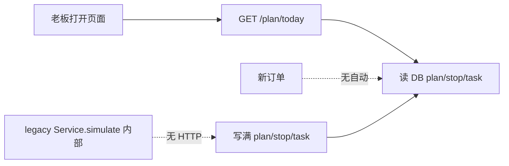
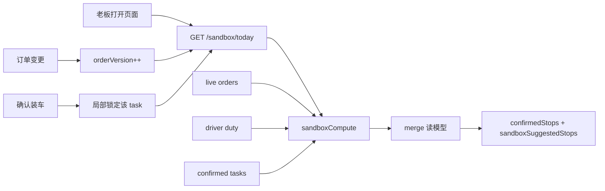

# 路线派车：实时动态沙盘改造设计

> **版本**：Phase 3a Sandbox（已实施）  
> **正式合同**：[`Route-Dispatch-Backend-Handoff-20260622.md`](../route-dispatch/Route-Dispatch-Backend-Handoff-20260622.md)  
> **HTTP 变更（2026-06-22）**：`POST /preview`、`POST /confirm`（顶层）**已删除**；老板正式页用 `GET /dispatch/sandbox/today` → `pageViewModel`。  
> **HTTP 变更（2026-06-23）**：顶层 `POST /simulate` **已删除**；`GET /driver/loading/today`、`GET /driver/delivery/today`、`GET /driver/route/today` **已删除**（Controller 无注册）。  
> **前置文档**：`Phase1.5a-Route-Dispatch-API.md`（已废弃，见 archive）  
> **目标读者**：后端 / 小程序 / Cursor 后续窗口  
> **约束**：不改 bill / order history 主链；不新增订单快照层；不写 Runner 测试

---

## 0. 一句话定义

**动态沙盘** = 基于当前 live orders + 当前司机可派状态 + 已确认客户锁定约束，**纯内存实时计算**的派车建议；  
**已确认执行** = 老板对某个客户点击「确认装车/准备发车」后，**第一次**落库锁定，不再参与沙盘自动重排。

打开今日派车页 **不应** 展示「页面打开时生成并固化的 DB 方案」，而应展示 **打开瞬间的最新沙盘 JSON**。

### 0.1 强原则：沙盘阶段不落库

| 阶段 | 是否写库 | 说明 |
|------|----------|------|
| GET `/sandbox/today` | **禁止** | 只读 live orders、duty、已确认执行记录；内存 merge 后返回 JSON |
| 未确认客户 | **禁止** | 不得提前写 plan / driver_route / route_stop / shipment_task / task_item |
| POST `/sandbox/stops/confirm` | **允许** | 老板确认「可装车」后 **第一次** 写执行记录 |
| POST `/simulate` | **HTTP 已删除（2026-06-23）**；`DisRouteDispatchService.simulate()` 仅内部 | 仍会全量持久化；**不是**老板主流程 |

**sandboxSuggestedStops** = 纯接口返回，**没有** `taskId` / `routeStopId` / `deliveryStopId`。  
**confirmedStops** = 来自 DB 执行记录；对外主键统一 **`deliveryStopId`**（当前 = `nx_dis_shipment_task.nx_dst_id`），**不再**向主流程暴露 `routeStopId` / `nxDrsId`。

旧 DB 中 `SIMULATED` plan/task/stop 残留 **不是** 当前沙盘主权；进入 `invalidStops` 供清理，不参与建议展示。一次性清理见 `docs/sql/patches/cleanup_nx_dis_route_sandbox_stale_data.sql`。

### 0.2 开发阶段强规则：strict contract / fail fast（禁止静默兜底）

当前为**开发验收阶段**，前后台均 **禁止** 为「页面暂时能显示」而做字段兜底、旧结构兜底、旧表兜底。

| 原则 | 说明 |
|------|------|
| 接口缺字段 | 暴露为接口/读模型错误，**补 canonical DTO**，不让前端从 nested legacy 猜 |
| 前端缺字段 | 显示开发态错误（如「缺少 confirmedStops[].deliveryStopId」），**禁止** `stop.shipmentTask.nxDstId` 等兜底链 |
| 后端缺数据 | 修 enrichment / assembler，**禁止** 从 `route_stop`、simulate、旧表拼假 stop |
| 司机卡片 stops | **唯一来源** = `plan.driverRoutes[i].stops`；**禁止** 把全局 `sandboxSuggestedStops` 塞进司机卡片 |
| 空态 | 允许 `stops=[]` 显示「暂无站点」；**禁止** 静默找旧字段/旧 ID |

**confirmed stop canonical 顶层字段**（`confirmedStops[]` 与 `driverRoutes[].stops[]` 共用 `RouteDispatchReadModelAssembler.toConfirmedCanonicalStopMap`）：

`deliveryStopId`, `departmentId`, `departmentName`, `driverUserId`, `driverRouteId`, `stopSource=CONFIRMED`, `status`, `statusLabel`, `plannedArrivalLabel`, `plannedDepartureLabel`, `customerWindowLabel`（有时窗时）, `canReturnToSandbox`, `returnToSandboxConfirmMessage`, …

**sandbox suggested stop canonical**：`sandboxStopKey`, `departmentId`, `departmentName`, `suggestedDriverUserId`, `stopSource=SANDBOX_SUGGESTED`, `liveOrderIds`, … — **不得** 含 `deliveryStopId`。

**禁止**：`nxDrsId` / `routeStopId` / `nxDstId` 作为对外主键；GET 写库；simulate / route_stop 回主流程。

---

## 1. 业务主线（目标体验）

老板打开今日派车页，自动看到：

| 区块 | 含义 |
|------|------|
| 今日路线日 / 批次 | `routeDate`、`dispatchBatch` |
| 有效订单客户 | 来自 live orders 实时聚合 |
| 司机可派状态 | driver duty |
| 系统建议分派 | **sandboxSuggestedStops**（未确认） |
| 已确认客户 | **confirmedStops**（局部锁定） |
| 未分派 / 异常 | **unassignedStops** / **invalidStops** |
| 操作入口 | 调送达时间、确认装车、返回沙盘、打印 bill |

**用户不应** 反复手动点「重新生成派车方案」或手动刷新才能看到新订单。

---

## 2. 两类派车对象

### 2.1 动态沙盘建议态（Sandbox / Proposed）

- 尚未确认装车/发车
- 系统根据 **当前** live orders 实时算出：建议司机、建议顺序、ETA、可行性
- **不是固定计划**；商品名/数量/规格/备注/送达日期 **实时读** `nx_department_orders`
- 允许随订单增删改、送达时间调整、司机 duty 变化 **自动重算未确认部分**

### 2.2 已确认执行态（Confirmed / Execution）

- 老板确认某客户装车完成 / 准备发车 / 进入 bill 流程
- 该客户的：司机、站点顺序、task/item 关联、bill 链路 **局部锁定**
- 写入或更新 **执行记录**（task ASSIGNED+、route_stop 执行态、manualLocked=1）
- **沙盘不得** 自动改派、改序、取消

### 2.3 状态语义对照（现状 → 建议）

| 业务语义 | 建议命名 | **现有代码/DB** | 说明 |
|----------|----------|-----------------|------|
| 沙盘建议 | `SANDBOX` / `PROPOSED` | `task.status = SIMULATED` | **保留 SIMULATED 常量**，文档称「沙盘建议」 |
| 未确认无坐标 | — | `UNASSIGNED` | 保留 |
| 装车确认 / 人工分车 | `LOADING_CONFIRMED` | `ASSIGNED` + `manualLocked=1` | 保留 ASSIGNED |
| 准备打印 bill / 可出发 | `READY_TO_GO` | `READY_TO_GO` | 保留；plan 侧 `READY` |
| 配送中 / 已送达 | — | `IN_DELIVERY` / `DELIVERED` | Phase 1 预留 |
| 作废 | — | `CANCELLED` / `CLOSED` | 保留 |
| 确认后退回沙盘 | `RETURNED_TO_SANDBOX` | **无专用状态** | 新操作：ASSIGNED→SIMULATED，清 manualLocked，保留 assigned 可选 |

**plan.status 现状**

| 值 | 现状含义 | 改造后 |
|----|----------|--------|
| `SIMULATED` | 整 plan 像「固定沙盘方案」 | 仅表示「仍有未确认客户」；**不等于固定方案** |
| `ASSIGNED` | 至少一 task 已确认 | 保留：表示存在已确认执行态客户 |
| `READY` | 全部 active task READY_TO_GO | 保留 |
| `CANCELLED` | 作废 | 保留 |

**不盲目大改枚举**：先在文档与读模型字段上区分 `confirmed` vs `sandboxSuggested`；Phase 3 再评估是否新增 DB 列 `execution_phase`。

---

## 3. 订单主权

| 阶段 | 主权表 | 派车 item 职责 |
|------|--------|----------------|
| 未确认装车/发车 | `nx_department_orders` | 只存 `liveOrderId` 关联 |
| 已打印 bill / 出车后 | `nx_department_order_history` | 存 `historyOrderId`、`billId` |
| **禁止** | task_item 的 goodsName/quantity/standard | **legacy 列，只读兼容，不写、不当主权** |

读模型组装规则（已实现，须保持）：

- GET 时 `DisRouteShipmentTaskItemOrderResolver` 批量 enrich
- **confirm 之后** 才 upsert `shipment_task_item`（仅 `liveOrderId`）
- sandbox compute **不写库**；内存 virtual task 仅用于优化与读模型

---

## 4. 当前实现：沙盘 vs 落库（Phase 3a）

### 4.1 读路径：`GET /sandbox/today`（主链，不写库）

`DisRouteSandboxComputeServiceImpl.compute()`：

1. 读 eligible live orders（`nx_department_orders`，仅 `do_status` 等业务口径）
2. 读 driver duty
3. 读 **已确认执行** task/stop（ASSIGNED+ / manualLocked=1）
4. 将旧 `SIMULATED` / `UNASSIGNED` 残留 task → `invalidStops`（**不**当沙盘建议）
5. 对未确认客户在 **内存** 构建 virtual task + 跑优化器
6. merge → `sandboxSuggestedStops` / `confirmedStops` / `unassignedStops`
7. **零** insert/update

`DisRouteSandboxTodayServiceImpl.buildToday()` 同样不写库。

### 4.2 写路径：`POST /sandbox/stops/confirm`（第一次落库）

`DisRouteSandboxConfirmServiceImpl.confirmStop()`：

1. 校验 eligible live orders / 未 bill / 未 history
2. 创建或关联 `nx_dis_route_plan`（ASSIGNED）
3. 创建 `shipment_task` + `task_item`（仅 liveOrderId）
4. 创建 `route_stop` + `driver_route`
5. 设置 `manualLocked=1`、ASSIGNED
6. 返回最新 `GET /sandbox/today` 读模型

### 4.3 Legacy：顶层 `POST /simulate`（HTTP 已删除）

**顶层 `POST /simulate` HTTP 已删除（2026-06-23）**；`NxDisRouteDispatchController` 无此路径。  
`DisRouteDispatchServiceImpl.simulate()` 仍会 upsert plan/task/stop/item，**仅 Service 内部 legacy**，无 HTTP 入口。前端今日派车页 **不得** 调用；`apiRouteDispatch.simulateRoute` 为死 export。

### 4.4 读模型 ID 规则

| 分区 | taskId | routeStopId | 来源 |
|------|--------|-------------|------|
| `sandboxSuggestedStops` | **无** | **无** | 内存计算 |
| `unassignedStops` | **无** | **无** | 内存计算 |
| `confirmedStops` | 有 | 有 | DB 执行记录 |
| `invalidStops` | 可有 | — | 旧 SIMULATED 残留 |

`RouteDispatchReadModelAssembler.toEphemeralStopMap()` 会剥离持久化主键。

### 4.5 旧问题（已修复）

| 问题 | 修复 |
|------|------|
| 打开页面读 SIMULATED plan 当主权 | `loadPlanContext` 只读 ASSIGNED/READY；否则内存空 plan |
| simulate 持久化未确认客户 | 主链改 GET compute；顶层 simulate HTTP 已删 |
| suggested stop 带 taskId | ephemeral 读模型剥离 ID |
| 前端「重新生成派车方案」调 simulate | 改为「刷新沙盘」= 重新 GET |

---

## 5. 表职责重新整理

| 表 | 改造后职责 | Legacy / 注意 |
|----|------------|---------------|
| `nx_department_orders` | **未确认前订单主权** | 不改主链 |
| `nx_department_order_history` | **打印/出车后历史主权** | 不改主链 |
| `nx_dis_route_plan` | 配送日/批次 **上下文容器**（disId+routeDate+batch）；**≠ 固定方案** | plan 汇总距离/时长为 cache |
| `nx_dis_driver_route` | **已确认/执行中** 司机路线；沙盘建议可标记 `route_kind=SANDBOX` 或仅存内存 | `nx_ddr_stop_count` 等为 cache |
| `nx_dis_route_stop` | **已确认/执行中** 站点；沙盘建议可 ephemeral | stop 上 depName/ETA 为展示 cache |
| `nx_dis_shipment_task` | 客户派车任务；区分 sandbox 建议 vs 已确认执行（同表，靠 status+manualLocked） | depName/lat 为 cache，读时以 department 为准 |
| `nx_dis_shipment_task_item` | **仅订单 ID 关联** + bill/history 回填 | `goods_name/quantity/standard` **legacy** |
| `nx_dis_driver_duty` | 老板控制司机可派 | simulate/compute 输入 |
| `nx_dis_route_stop_order`（若仍存在） | **deprecated**，停止写入 | — |

### 5.1 什么情况下才落库

| 事件 | 落库内容 |
|------|----------|
| GET `/sandbox/today` | **不落库** |
| 老板确认装车 `POST /sandbox/stops/confirm` | **第一次**写 task/item/stop/route/plan |
| 打单完成 bill hook | item→historyOrderId/billId, task→READY_TO_GO |
| 返回沙盘 `returnToSandbox` | task→SIMULATED, manualLocked=0（后续） |
| POST `/simulate`（顶层） | **HTTP 已删除**；`DisRouteDispatchService.simulate()` 仅内部 legacy，全量持久化 — **勿用于主流程** |

### 5.2 什么情况下只是实时建议

- 未确认客户的：建议司机、顺序、ETA、可行性、商品明细
- 新订单客户首次出现在沙盘
- 订单数量变更后的分派建议
- 司机 duty 变化后的重新分配（仅未确认）

---

## 6. `/simulate` 处置方案

### 6.1 结论（Phase 3a 已实施）

| 动作 | 说明 |
|------|------|
| **顶层 POST /simulate** | **HTTP 已删除（2026-06-23）**；无 Controller 入口 |
| **GET /sandbox/today** | 老板主链（debug 全量）；正式页用 `GET /dispatch/sandbox/today` |
| **POST /sandbox/stops/confirm** | 唯一日常写库入口（按客户确认） |

### 6.2 内部服务语义

```
DisRouteSandboxComputeService.compute() → SandboxComputeResult
```

- 输入：live orders、duty、已确认锁定集
- 输出：sandboxSuggestedStops、confirmedStops、invalidStops、版本号
- **不** 写 plan/task/stop/item
- **不** 复制订单商品快照到 DB
- **不** 改动 manualLocked / ASSIGNED+ 的 task

### 6.3 与旧 simulate 关系

- `DisRouteDispatchServiceImpl.simulate()` 保留为 **Service 内部 legacy**，**无 HTTP 入口**；**不得**被 sandbox/today 主链调用
- 前端 `simulateRoute` 指向已删 HTTP，为死 export；今日页「刷新沙盘」= 重新 GET

---

## 7. 读模型目标：`GET /sandbox/today`（或增强 `/plan/today`）

### 7.1 推荐接口

**首选**：`GET /api/nxdisroutedispatch/sandbox/today`  
**兼容**：`GET /plan/today?includeSandbox=true&autoCompute=true`（默认 true）

### 7.2 响应结构（完整读模型）

```yaml
SandboxTodayResponse:
  routeDate: string
  dispatchBatch: string
  serverNow: datetime
  sandboxVersion: string          # hash(disId+routeDate+batch+orderVersion+dutyVersion+confirmedSig)
  orderVersion: string            # max(order.updated_at) 或 count+checksum
  dutyVersion: string
  hasNewOrders: boolean
  hasOrderChanges: boolean
  hasLockedStops: boolean
  plan: RoutePlanContext          # 上下文，非「固定方案」
  drivers: DriverDutyDto[]
  confirmedStops: StopReadModel[]       # ASSIGNED+ / manualLocked；含 taskId / routeStopId
  sandboxSuggestedStops: StopReadModel[] # 内存建议；**无** taskId / routeStopId
  unassignedStops: StopReadModel[]       # 无坐标等；**无** taskId
  invalidStops: InvalidStopDto[]         # 已有 integrity
  effectiveOrders: OrderSummaryDto[]     # 可选，eligible 订单摘要
  dispatchWorkbench: WorkbenchDto
  feasibilityStatus: string
  warnings: WarningDto[]                 # 必须基于过滤后 stops 计算
  canConfirmCustomer: boolean
  canPrintBill: boolean
  canDepart: boolean
  batchStartAt: datetime | null   # 沙盘聚合：各路最早出发（无站点时为 null）
  batchEndAt: datetime | null     # 沙盘聚合：各路最晚回来（无站点时为 null）
```

**时间窗口主权（Phase 3a 修订）**：

- 页面头部 **不** 使用 `DisRouteBatchDefaults` 硬编码的早班 05:30–12:00，也 **不** 直接读 DB plan 上陈旧的 `nx_drp_batch_*`。
- `batchStartAt` = 各路 `nx_ddr_planned_depart_at` 的 **最小值**（最早出发）。
- `batchEndAt` = 各路 `nx_ddr_planned_finish_at` 的 **最大值**（最晚回来，末站离开时刻）。
- **0 个站点** 时：`batchStartAt` / `batchEndAt` 均为 null，不展示时段、不展示「早班」标签、不因默认批次结束时间显示「已过期」；横幅仅「今天」。
- `DisRouteBatchDefaults`（MORNING 05:30–12:00 等）**仅**用于司机上岗/批次 eligibility 内部逻辑，**不得**作为沙盘页头部展示时间。
- **展示班次**（`displayShiftCode` / `displayShiftLabel`）：路线日为**今天**时，按 **serverNow** 划分：`00:00–11:59` 早班、`12:00–17:59` 中班、`18:00–23:59` 晚班；与 API 参数 `dispatchBatch=MORNING`（订单筛选/落库）解耦。
- `planTemporalStatus` 的 EXPIRED 判定：仅当 `routeDate` 为过去，或 **今天且 serverNow 晚于 batchEndAt**（有站点时）。

**tasks / driverRoutes** 可保留为兼容字段，但文档标明：优先使用 `confirmedStops` + `sandboxSuggestedStops` 分区展示。

### 7.3 GET 行为（核心改造）

```
GET /sandbox/today
  1. 加载 plan 上下文（若无则创建空上下文，status=SIMULATED）
  2. 加载 confirmed tasks（ASSIGNED+ / manualLocked）
  3. 查询 eligible live orders（**仅** disId + `do_status < 3` 等业务口径，**不按** arriveDate / 页面 routeDate 过滤）
  4. 调用 sandboxComputeService.compute()  → 仅重算未确认 dep
  5. merge confirmed + suggested → 读模型
  6. enrich items from live orders
  7. assess feasibility on merged view
  8. 返回 sandboxVersion / orderVersion
```

**注意**：GET 触发 compute 在实现上可用「短 TTL 缓存 + 版本号」避免每次全量矩阵；但语义上 **打开即最新**。

### 7.4 时间锚点主权：正式预排 vs 即时补单

| 模式 | code | 时间锚点 | 适用场景 |
|------|------|----------|----------|
| 正式预排 | `SCHEDULED_BATCH` | 客户 `earliestDeliveryTime` / `latestDeliveryTime` | 送达日=今天且当前在常规窗口前/内；明天早上正式批次预排 |
| 即时补单 | `ADHOC_NOW` | **serverNow** | 今晚临时补单；送达日在未来；已过客户常规窗口；老板问「现在最快几点到」 |

**判定要点（后端 `DisRouteSandboxScheduleModeResolver`）**：

- `arriveDate` 晚于今天 → **ADHOC_NOW**（不因 arriveDate=明天就排到明早 07:02）
- 送达日=今天且 `serverNow` 已过 `latestDeliveryTime` → **ADHOC_NOW**
- 送达日=今天且 `serverNow` 早于 `earliestDeliveryTime` → **SCHEDULED_BATCH**（提前看正式批次）

**ADHOC_NOW 排程**：

- `plannedDepartAt = serverNow`
- `plannedArrivalAt = depart + legDuration`（不等客户明早窗口）
- 客户常规窗口仅作 **参考**（`customerWindowLabel`），不作为下限
- 超过常规窗口 → `SUPPLEMENT_AFTER_WINDOW` / `isAfterCustomerWindow`，**不算**正式批次「迟到 N 分钟」

**读模型字段（stop / route / 响应根）**：

- `scheduleMode`, `scheduleModeLabel`
- `timeBasis`, `timeBasisLabel`
- `timeAnchorAt`, `timeAnchorLabel`
- `fastestArrivalLabel`, `plannedDepartLabel`
- `customerWindowLabel`, `isAfterCustomerWindow`
- 计划级：`sandboxScheduleMode`, `scheduleBannerLine`, `scheduleBasisLabel`

前端 **只读后端 label**，不自行拼「今天/明天」或猜迟到。

---

## 8. 局部确认、局部锁定

### 8.1 确认装车（已有 assign，增强语义）

`POST /tasks/{taskId}/confirm-loading`（或沿用 `/assign`）

**仅影响该 task（客户）**：

- task → ASSIGNED, manualLocked=1
- 写 assignedDriverUserId, assignConfirmedAt
- 写 **执行态** route_stop（从 suggested 提升）
- plan.status → 至少 ASSIGNED
- **不** 改其他 SIMULATED task
- **不** 阻止后续 sandbox 重算其他客户

### 8.2 局部锁定规则

| 对象 | 锁定范围 |
|------|----------|
| 客户 A 确认 | A 的 task、stop、assigned 司机、顺序 |
| 客户 B/C/D/E 未确认 | 继续参与 sandbox compute |
| plan | **不** 整体锁定；仅作上下文 |
| driver_route | 已确认 stop 计入执行 route；未确认仅在 sandbox 视图 |

### 8.3 返回沙盘（新接口，Phase 3c）

`POST /tasks/{taskId}/return-to-sandbox`

（Phase 3a 未实现，见分阶段计划）

### 8.4 Phase 3a 已实现的确认入口

**`POST /api/nxdisroutedispatch/sandbox/stops/confirm`**

沙盘建议客户 **无需预先 taskId**。请求体：

```yaml
SandboxStopConfirmRequest:
  disId: integer          # 必填
  routeDate: string       # 可选，默认今天
  batchCode: string       # 可选，默认 MORNING
  depFatherId: integer    # 与 sandboxStopKey 二选一
  sandboxStopKey: string  # 格式 dep:{depFatherId}
  driverUserId: integer   # 必填（通常取建议司机）
  operatorUserId: integer # 必填
  manualStopSeq: integer  # 可选
  assignReason: string
  liveOrderIds: integer[] # 可选校验
  taskId: integer         # 可选；旧数据快路径走 assign
```

行为：校验 eligible live orders → 创建/更新 task + item（仅 liveOrderId）→ 创建 route_stop → ASSIGNED + manualLocked=1 → 返回最新 `sandbox/today` 读模型。

若已有 `taskId`（旧 simulate 残留），内部复用 `assignTask`。

---

## 9. 沙盘何时自动重算

| 触发 | 机制 | 重算范围 |
|------|------|----------|
| 页面 onShow / GET sandbox/today | sync compute（或 stale 则 compute） | 未确认 |
| 客户新增/删/改订单 | 订单写路径发 `DispatchOrderChangedEvent` 或 Redis version bump | 未确认 |
| 修改送达日期 | 同上 | 未确认 |
| POST `/tasks/{id}/time-window` | 响应内嵌 compute 或 bump version | 未确认 |
| 司机 duty check-in/out | duty 写路径 bump dutyVersion | 未确认 |
| 确认装车 | 锁定该 task；compute 其余 | 未确认 |
| 返回沙盘 | 释放该 task；compute | 未确认 |

**已确认 task**：`isTaskSimulateProtected()` 继续作为保护门。

### 9.1 新增 10 个客户

1. 订单进入 `nx_department_orders`（`do_status < 3`，沙盘 **不限** arriveDate；送达日以订单字段为准参与排程）
2. orderVersion 变化
3. 下次 GET sandbox/today（或 WebSocket/轮询检测 version）触发 compute
4. 10 个新 dep 进入 `sandboxSuggestedStops`
5. 优化器把近邻客户分给已有路线司机 64，远的分给其他司机
6. **已确认客户 A** 不动

### 9.2 老板调整送达时间

1. `POST /tasks/{id}/time-window` 更新 override
2. 同步或异步 `sandboxComputeService.compute()`
3. 仅未确认客户的 ETA / feasibility / 顺序 更新
4. GET 返回新 sandboxVersion

### 9.3 已确认客户订单变化

| 状态 | 行为 |
|------|------|
| ASSIGNED，未 bill | 读模型标记 `orderChangedSinceConfirm=true`；允许老板 **返回沙盘** 或 **人工加单**（现有补单规则） |
| READY_TO_GO / 已 bill | 不自动改；workbench 异常；人工处理 |
| 已出车 | 不自动改 |

---

## 10. 设计原则（检查清单）

1. ✅ 未确认客户：动态计算，不提前锁死  
2. ✅ 已确认客户：局部锁定，不影响其他客户流动  
3. ✅ 订单主权在 orders/history，不在派车快照  
4. ✅ 沙盘打开即最新，不靠用户手动刷新  
5. ✅ 调时间、订单变更、duty 变更 → 重算未确认部分  
6. ✅ simulate 不是老板日常主流程  
7. ✅ 前端不隐藏旧数据（invalidStops 明示）  
8. ✅ 旧 plan/stop/task 不抢订单主权  
9. ✅ 不自动覆盖人工确认客户  
10. ✅ 不全局重置已确认客户  

---

## 11. 前端改造要点（文档约束，非本阶段代码）

| 现状 | 目标 |
|------|------|
| onLoad/onShow 只 GET plan | onShow 调 `GET /sandbox/today`（autoCompute 默认 true） |
| 按钮「重新生成派车方案」 | 移除或藏到调试；主文案改为「刷新沙盘」且 **通常不需要** |
| 司机卡片 stopCount 用 DB | 用 `confirmedStops+sandboxSuggestedStops` 长度 |
| 分区 UI | **已确认** / **建议中** / **未分派** / **异常** 四块 |
| 停留刷新 | 轻量轮询 `orderVersion` / `sandboxVersion`（如 30～60s，评估小程序成本） |

`apiRouteDispatch.js` 注释主链改为：

```
live order → sandbox compute（自动）→ suggestedDriver → confirm-loading → ASSIGNED → bill → READY_TO_GO
```

---

## 12. 待删除 / deprecated 清单

| 项 | 处置 |
|----|------|
| 顶层 `POST /simulate` | **HTTP 已删除（2026-06-23）**；Service `simulate()` 仅内部 |
| `POST /preview` | **HTTP 已删除** |
| `POST /confirm`（顶层） | **HTTP 已删除** |
| `GET /driver/loading/today`、`/driver/delivery/today`、`/driver/route/today` | **HTTP 已删除（2026-06-23）** |
| `POST /plan/{id}/reoptimize` | 合并进 sandbox compute；对外 deprecated |
| workbench「请重新生成派车方案」 | 改为「沙盘将自动更新」或「存在无效历史站点，请确认装车/返回沙盘」 |
| task_item goods 列写入 | 禁止（已大部分完成） |
| stop_order 主权 | deprecated |
| GET 直接展示 raw `nx_ddr_stop_count` | 读模型 overlay（已部分完成） |
| `DisRouteDispatchSnapshotHelper` 写商品快照 | 删除写路径 |

---

## 13. 分阶段改造计划

### Phase 3a — 读模型与自动 compute（**已实现**）

- [x] 抽取 `DisRouteSandboxComputeService`（`DisRouteSandboxComputeServiceImpl`）
- [x] `GET /sandbox/today`：读 + 内存 compute merge（GET 不写库）
- [x] 响应增加 `confirmedStops` / `sandboxSuggestedStops` / `unassignedStops` / versions
- [x] `POST /sandbox/stops/confirm`：无 taskId 确认入口
- [x] assess/warnings：无 planId 时用内存 schedule 迟到警告
- [x] 前端 today 页改调 `getSandboxToday`；顶层 simulate HTTP 已删
- [x] 文档更新 API 清单

### Phase 3a.1 — 执行模型瘦身（**3a.1b 已实施**）

> 本节为 Phase 3a.1 审查结论与改造约束。**不删表**，先从 service 主链摘掉冗余 ID / 旧快照写路径。

#### 1. ID 与表职责（审查结论）

| 阶段 | 前端 ID | DB 来源 | 说明 |
|------|---------|---------|------|
| 沙盘建议 | `sandboxStopKey` | 无（`dep:{depFatherId}`） | 纯内存，不落库 |
| 已确认执行 | `deliveryStopId` | `nx_dis_shipment_task.nx_dst_id` | 确认后第一次落库；**即** 原 `taskId` |

**taskId 与 routeStopId 是否重复？** — **是（确认后 1:1）**。

- `POST /sandbox/stops/confirm` 同时写 `nx_dis_shipment_task` 与 `nx_dis_route_stop`（`upsertRouteStop`）。
- 关联：`nx_dis_route_stop.nx_drs_shipment_task_id` → `nx_dis_shipment_task.nx_dst_id`，DAO `queryByShipmentTaskId` 保证一对一。
- `route_stop` 当前额外承载：`stopSeq`、`legDistance/Duration`、排程 ETA（`plannedArrivalAt` 等）、`driverRouteId` 间接关联；其中客户名/坐标/订单数等与 task **重复快照**（`DisRouteDispatchSnapshotHelper.copyTaskSnapshotToStop`）。

**结论**：业务上「一个分店配送任务 = 一个客户站点 = 司机一趟中的一个 stop」成立；**执行主权应在 `shipment_task`**，`route_stop` 是 Phase 1 simulate 遗留的几何/排程快照壳，**无独立业务实体价值**，可 deprecated。

#### 2. 建议三层执行模型

| 层 | 表 | 职责 |
|----|-----|------|
| 司机趟次 | `nx_dis_driver_route` | `driverRouteId`、司机、`status`（LOADING→READY_TO_DEPART→IN_DELIVERY→COMPLETED）、`departAt`/`finishAt`、趟次统计 |
| 分店配送任务 | `nx_dis_shipment_task` | **`deliveryStopId`**、`driverRouteId`（待迁列）、`routeSeq`/`manualStopSeq`、ETA、`status`、manualLocked、confirmAt/By、printStatus（弱参考） |
| 订单关联 | `nx_dis_shipment_task_item` | liveOrderId、historyOrderId、billId（弱参考）、itemStatus |

#### 3. `nx_dis_route_stop` 处置

| 项 | 处置 |
|----|------|
| 新主链 confirm | **停止写入**（Phase 3a.1b）；ETA/stopSeq/`driverRouteId` 迁到 task |
| 新读模型 | confirmed 不返回 `routeStopId`/`nxDrsId`；内部排程暂可读 legacy stop，不参与 sandboxSuggested |
| 旧数据 | legacy only；cleanup SQL 后续单独写 |
| 表本身 | **暂不 DROP**；文档标记 **deprecated** |

**保留理由（过渡期）**：`DisRouteScheduleServiceImpl`、`DisRouteFeasibilityServiceImpl`、`DisRoutePlanPresentationHelper` 仍按 plan→driver_route→**stops** 迭代；需先改 schedule/feasibility 读 task 再停表。

#### 4. `nx_dis_route_plan` 处置

| 项 | 结论 |
|----|------|
| confirm 是否创建 plan | **是** — 作为当日批次执行上下文头（disId + routeDate + batchCode + depot + ASSIGNED/READY） |
| 能否去掉 plan | **短期不能** — `driver_route.nx_ddr_plan_id`、`task.nx_dst_plan_id`、schedule/feasibility 仍按 planId 聚合 |
| 定义 | **执行上下文**，不是沙盘方案 |
| GET `/sandbox/today` | **禁止**为展示创建 plan；`loadPlanContext` 只读 ASSIGNED/READY，无则内存空壳 |
| planId 主权 | **不得**进入 sandboxSuggestedStops；仅 confirmed 执行聚合使用 |

#### 5. 前端 ID 规则

| 区块 | 使用 ID | 禁止 |
|------|---------|------|
| `sandboxSuggestedStops` | `sandboxStopKey` | taskId / routeStopId / planId |
| `confirmedStops` | `deliveryStopId`（= nxDstId） | routeStopId / nxDrsId / shipmentTaskId 混用 |

当前小程序 `routeDispatch/_helpers.js` **未读** `routeStopId`/`nxDrsId`，但仍在用 `taskId`；Phase 3a.1b 统一别名为 `deliveryStopId`。

#### 6. 旧方法 deprecated / 主链摘除清单

| 方法 / 路径 | 现状 | Phase 3a.1 目标 |
|-------------|------|-----------------|
| `DisRouteDispatchServiceImpl.simulate` | legacy 全量写库 | **无 HTTP 入口**；**不得**回到主流程 |
| `resolveOrCreateActivePlan` / `ensureDriverRoutes` | 仅 simulate | 保留在 legacy；sandbox 不调用 |
| `persistTaskDispatchSnapshot` / `reconcileStaleTaskItems` / `reconcileOrphanPlanTasks` | 仅 simulate | 同上 |
| `DisRouteSandboxConfirmServiceImpl.upsertRouteStop` | **新 confirm 仍写** | **摘掉**（3a.1b） |
| `queryTasksByPlanId` 用于沙盘建议 | sandbox compute 不用 | 仅执行聚合 / legacy simulate |
| `loadPlanContext` 读 SIMULATED plan | 无 DB 写；空壳仅内存 | 保持；不固化 |
| `POST /preview` / `POST /confirm` | 已下线 | 保持 |
| `apiRouteDispatch.simulateRoute` | 指已删 HTTP | 死 export；页面不得调用 |

#### 7. 配送单 / bill 弱参考（待修项）

| 规则 | 当前代码 | 目标 |
|------|----------|------|
| 老板确认 = 分店可装车主状态 | confirm → ASSIGNED + manualLocked | ✓ |
| 司机出发 = 司机主状态 | driver route / task IN_DELIVERY | ✓（既有） |
| bill 打印 **非** 可出发硬门槛 | `promoteTaskToReadyToGoIfEligible` 要求 `allActiveItemsHaveBill`；`revertTaskFromReadyToGoIfNeeded` 无 bill 则降级 | **3a.1b 改为弱参考**：printStatus 提示，不阻塞 READY_TO_DEPART |
| confirm 防重复 | `rejectBillConflict` 已打印 bill 的 order 不可重复 confirm | ✓ 保留 |

#### 8. legacy 字段不得再作主权

| 字段 / 表 | 说明 |
|-----------|------|
| `nx_dis_route_stop.*` 客户名/坐标 | 展示用 `liveDepartmentName` + task 坐标 |
| `SIMULATED` plan/task | 进 `invalidStops`，非沙盘主权 |
| `task_item` 商品名/数量 | 仍从 orders/history 读 |
| `stop_order` | deprecated |
| `planId` on suggested stops | 禁止 |

#### 9. Phase 3a.1b 实施结果（2026-06）

| 项 | 状态 |
|----|------|
| bill 打印弱参考 | ✅ `promoteTaskToReadyToGoIfEligible` / bill 回退不再升降级 READY_TO_GO |
| API `deliveryStopId` | ✅ `RouteDispatchReadModelAssembler` confirmed 输出 |
| confirm 停写 route_stop | ✅ `DisRouteSandboxConfirmServiceImpl` 只写 task + driver_route |
| schedule/feasibility task 驱动 | ✅ `DisRouteScheduleServiceImpl` / `DisRouteFeasibilityServiceImpl` / `DisRoutePlanPresentationHelper` |
| task 执行字段 | ✅ SQL `upgrade_nx_dis_route_dispatch_phase3a1.sql` |
| 前端 deliveryStopId | ✅ `_helpers.js` / `today.js` / loading / delivery |
| route_stop legacy | 表保留；读模型 `DisRouteDeliveryStopAdapter` 仅 fallback 旧 ETA |
| simulate 主流程 | 顶层 HTTP **已删**；仅 legacy `DisRouteDispatchServiceImpl.simulate`（内部） |

#### 10. Department Bill 弱参考规则

- 老板 confirm → `ASSIGNED` + `manualLocked`（主状态）
- `billPrintStatus` / `unprintedBillCount` / `billPrintWarning` 只读提示
- **禁止**因未打印配送单阻断装车/出发/READY_TO_GO 自动降级
- bill 回填仍写 `task_item.nx_dsti_bill_id`，不改 bill 主链

#### 9. Phase 3a.1 实施顺序（建议）

1. 读模型：`deliveryStopId` 别名；confirmed 响应隐藏 `routeStopId`/`nxDrsId`
2. confirm：停写 `route_stop`；task 增 `driverRouteId` + 排程字段（或暂从 stop 只读）
3. schedule/feasibility：改为 task 列表驱动
4. 去掉 bill→READY_TO_GO 硬门槛
5. 前端：`taskId` → `deliveryStopId` 别名
6. SQL cleanup / migration（后续）

### Phase 3b — 事件驱动重算

- [ ] orderVersion / dutyVersion 基础设施
- [ ] 订单 CRUD 后 bump version（或 MQ，初版可 DB max(updated_at)）
- [ ] time-window / duty 变更后 bump
- [ ] 小程序可选轮询 version

### Phase 3c — 返回沙盘（return-to-sandbox）

**业务定义**：撤销的是「派车确认关系」（task ↔ 司机 ↔ 装车确认），**不是**订单，**不是**配送单。

| 维度 | 说明 |
|------|------|
| 接口 | `POST /api/nxdisroutedispatch/sandbox/stops/{deliveryStopId}/return-to-sandbox` |
| 主键 | `deliveryStopId` = `nx_dis_shipment_task.nx_dst_id` |
| 返回 | 最新 `GET /sandbox/today` 读模型 |
| 订单 | **不删除** |
| bill / 配送单 | **不撤销**；**不作** return 阻断 |

**允许**：`ASSIGNED`、`READY_TO_GO`（整车尚未 `IN_DELIVERY`）  
**禁止**：本店或同趟 `IN_DELIVERY` / `DELIVERED` / `CLOSED`  
**不作阻断**：`billId`、`historyOrderId`、是否已打印

读模型：`canReturnToSandbox`、`returnToSandboxActionLabel`（「返回沙盘」）、`returnToSandboxWarning`、`returnToSandboxConfirmMessage`

实现：`DisRouteSandboxReturnServiceImpl`、`DisRouteReturnToSandboxPolicy`（2026-06 ✅）

### Phase 3D — 确认司机出发（driver-route depart）

**业务定义**：老板在**司机卡片**上确认整车出发；这是 **driverRoute 级**动作，不是门店级，不用 `deliveryStopId`。

| 维度 | 说明 |
|------|------|
| 接口 | `POST /api/nxdisroutedispatch/driver-routes/{driverRouteId}/depart` |
| 主键 | `driverRouteId` = `nx_dis_driver_route.nx_ddr_id` |
| 返回 | 最新 `GET /sandbox/today` 读模型 |
| 前置 | 该趟路线下**全部**待配送门店已在卡片上「确认出货」 |
| 配送单 | **未打印仅 warning**，不阻断出发 |

**允许出发**：路线有 confirmed stop、全部门店已确认、司机 `ON_DUTY`、路线未 `IN_DELIVERY`  
**禁止出发**：无 confirmed stop、仍有未确认门店、已出发/已完成/已关闭、司机不可派、plan `INFEASIBLE`  
**不作阻断**：`billId` / `historyOrderId` / 配送单未打印

**写库**：

- `nx_dis_driver_route.nx_ddr_route_status` → `IN_DELIVERY`
- `nx_ddr_actual_depart_at` / `nx_ddr_depart_operator_user_id` / `nx_ddr_depart_remark`
- `nx_ddr_dispatch_eligible` → `0`（退出沙盘可派池）
- 该路线全部 confirmed `shipment_task.nx_dst_status` → `IN_DELIVERY`

**出发后边界**：

- 全路线 `canReturnToSandbox=false`，`returnToSandboxBlockedReason=司机已出发，不能返回沙盘`
- 全路线 `canMove=false`，`moveBlockedReason=司机已出发，不能改派`
- 司机不再参与新沙盘分配
- 司机端 **勿再使用** `GET /driver/delivery/today`（**HTTP 已删**）；当前 jcJieDan 误用 `GET /delivery/today?driverUserId=`，待新建司机 pageViewModel 接口

读模型（`plan.driverRoutes[]` 与 `drivers[]`）：

- **顶层必填**（有 confirmed stop 时）：`driverRouteId`、`driverUserId`、`driverName`、`routeStatus` / `routeStatusLabel`、`confirmedStopCount`、`sandboxSuggestedStopCount`、`totalStopCount`、`canDepart`、`departBlockedReason`、`departConfirmMessage`、`departWarning`
- 空闲司机（无 DB 路线、无站点）：`driverRouteId=null`、`routeStatus=IDLE`、`routeStatusLabel=空闲`、`departBlockedReason=司机路线不存在`
- 前端确认出发 **只读** `driverRoutes[].driverRouteId`，禁止从 `stops[]` / `confirmedStops[]` / `shipmentTask` 兜底
- `canDepart`、`departActionLabel`（「确认司机出发」）、`actualDepartAt`

SQL：`docs/sql/patches/upgrade_nx_dis_route_dispatch_phase3d.sql`

实现：`DisRouteSandboxDriverDepartServiceImpl`、`DisRouteDriverDepartPolicy`（2026-06 ✅）

### Phase 3d — 持久化瘦身（并入 3a.1）

- [ ] confirm 停写 `route_stop`（见 §13 Phase 3a.1）
- [ ] task 承载 stopSeq / ETA / driverRouteId
- [ ] plan/driver_route 汇总字段改 confirm/schedule 时刷新
- [ ] 考虑 `route_kind` 列区分 SANDBOX vs EXECUTION
- [ ] `DROP`/archive `nx_dis_route_stop`（schedule 迁完后）

### Phase 3e — 清理

- [x] 对外移除顶层 POST /simulate（2026-06-23）
- [x] 删除 `GET /driver/*/today` HTTP（2026-06-23）
- [ ] 删除 legacy 快照写路径
- [ ] SQL comment 更新 legacy 列

---

## 14. 需修改的 Markdown 文档

| 路径 | 改动 |
|------|------|
| **本文** `docs/nxPlatform/Route-Dispatch-Sandbox-Design.md` | 主设计（新建） |
| `docs/nxPlatform/Phase1.5a-Route-Dispatch-API.md` | 顶部增加 Sandbox 链接；标注顶层 simulate / driver 旧 HTTP 已删；补充 `/dispatch/sandbox/today` |
| `docs/sql/patches/README.md` | 增加 Phase 3 sandbox 说明行 |
| `docs/sql/patches/upgrade_nx_dis_route_dispatch_phase1_5a.sql` 注释 | legacy 列说明（可选） |
| `jcJieDan/lib/apiRouteDispatch.js` 文件头注释 | 主链改为自动 sandbox |
| `electron-platform` / 其他前端 | 若引用 simulate，同上 |

---

## 15. 编译状态

Phase 3a 完成后：

```bash
mvn compile -DskipTests
# BUILD SUCCESS
```

---

## 16. 附录：当前 vs 目标数据流

### 现状（错误模式）



### 目标（动态沙盘）



---

## 17. 附录：回答用户十三项检查表

| # | 问题 | 答案摘要 |
|---|------|----------|
| 1 | 哪些表/接口把沙盘提前固化 | simulate 写 plan/route/stop/task；GET 只读库；见 §4 |
| 2 | 哪些应改为实时计算 | 未确认客户的 suggested 司机/顺序/ETA/商品/可行性 |
| 3 | 哪些必须在确认时才落库 | ASSIGNED+ 的 assignedDriver、执行 stop、manualLocked |
| 4 | simulate 命运 | 顶层 HTTP 已删；Service 内部 legacy；见 §6 |
| 5 | 局部确认/锁定 | assign 仅锁单 task；见 §8 |
| 6 | 订单变化如何影响沙盘 | orderVersion + GET/compute；见 §9 |
| 7 | 调送达时间 | time-window + compute；见 §9.2 |
| 8 | 新增 10 客户 | eligible 增加 → compute 重分未确认；见 §9.1 |
| 9 | 已确认客户订单变 | 未 bill 可 return-to-sandbox；已 bill 人工异常；见 §9.3 |
| 10 | 今日派车读接口 | `GET /sandbox/today` autoCompute；见 §7 |
| 11 | 改哪些文档 | 见 §14 |
| 12 | 旧逻辑 deprecated | 见 §12 |
| 13 | 分阶段计划 | 见 §13 |
| 14 | mvn compile | Phase 3a.1 审查时通过；见 §15 |
| 15 | taskId vs routeStopId 是否重复 | **是**，确认后 1:1；见 §13 Phase 3a.1 |
| 16 | deliveryStopId 承担字段 | `nx_dis_shipment_task.nx_dst_id` |
| 17 | route_stop / plan 是否废弃 | stop **deprecated**；plan **保留为执行上下文** |

---

*本文档为 Phase 3 设计基准。任何实现不得回退到「打开页面即固定方案、靠 simulate 同步订单」模式。*
