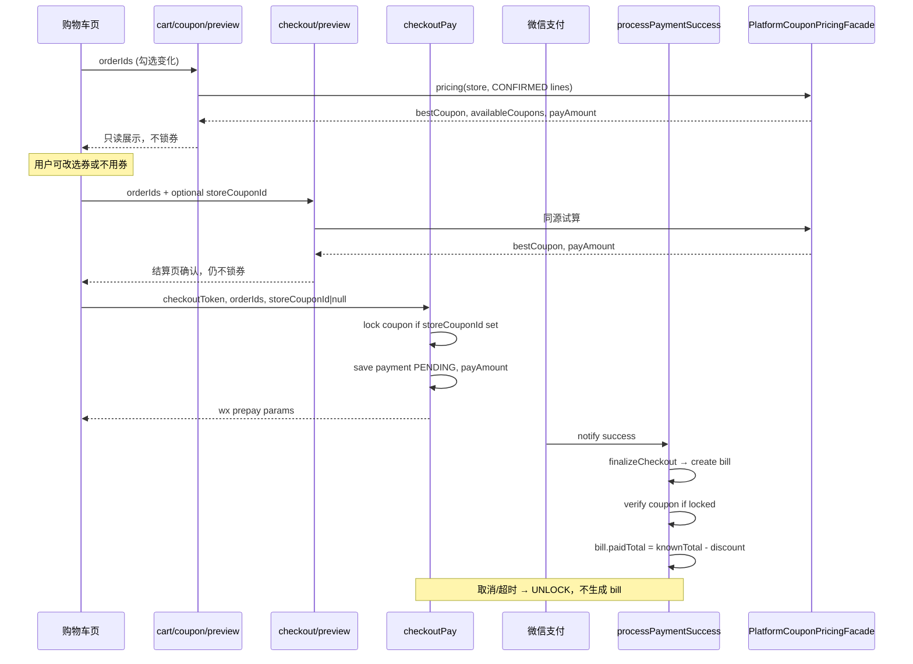

# 京采平台 · 增长系统（优惠券 / 推广员 / 转介绍）设计

> **文档性质**：只读梳理 + 目标架构设计（**不是**实现说明）。  
> **维护位置**：`docs/nxPlatform/`（与 `platform-cart-checkout-bill-design.md` 同级，业务主权以 checkout/bill 文档为准）。  
> **读者**：产品、后端。  
> **阶段**：第一阶段仅输出本文档，**不写业务代码、不改前端、不操作远程库**。  
> **关联文档**：  
> - 购物车 / checkout / bill 主权：`docs/nxPlatform/platform-cart-checkout-bill-design.md`  
> - 饭店端联调：`jingcaiMarket/docs/平台订货购物车接口说明.md`  
> - Community 推广注册奖励：`docs/nxCommunity/NxCustomerUser推广注册奖励接口说明.md`  
> - Community 优惠券：`docs/nxCommunity/优惠券功能说明.md`  

**京采平台优惠券主权（一句话）：** **市场发券、门店持券** — `market-level coupon template` + `store-level coupon instance`；市场后台由 **`platform_market_user`** 操作，饭店端由 **`gb_department_user`** 领券/用券。禁止共用 Community 券表（详见 §0.3、§0.6、§2.3、§5.0）。

---

## 0. 设计目标与硬边界

### 0.1 三大模块目标

| 模块 | 目标摘要 |
|------|----------|
| **平台优惠券（门店券）** | 平台向**门店**发券、门店领券/获券；**购物车页实时只读优惠预览** + checkout 用券；使用记录、过期/作废/已用；后续活动券、推广奖励券、转介绍奖励券 |
| **推广员 / 地推** | 平台创建推广员、独立推广码/二维码、新用户扫码注册绑定、业绩统计（拉新/首单/金额/奖励）、启用/暂停/终止、业绩明细 |
| **用户转介绍** | 老用户邀请新用户、注册记录邀请关系、**首单/首次支付成功**触发奖励（券/积分/余额）、防重复、邀请人/被邀请人双向奖励 |

### 0.2 优惠券与 checkout 的硬约束

| 约束 | 说明 |
|------|------|
| 只抵已知价 | 优惠金额仅基于 `priceConfirmStatus = CONFIRMED` 行的 `lineSubtotal` |
| 只动 knownTotal / payAmount | `payAmount = knownTotal - discountAmount`；`pendingPriceItemCount` 不变 |
| 不改变 order 正式化时机 | 仍由 checkout / 支付成功 finalize 决定 `status ≥ 0`、挂 bill |
| 不能让 PENDING 价行视为已付 | 未知价行不进本次微信支付金额，不因用券而改变 |
| 计价接在 checkout 批次 | **禁止**在 `addCartLine*` / order 创建时写券逻辑；**允许**购物车页对当前勾选行做**只读**优惠试算（不锁券、不写 bill） |

### 0.3 门店券主权（持券主体）

京采平台优惠券**不按登录用户**（`gb_department_user_id`）发放或持有，必须按**门店级** `gb_department` 持有。

| 原则 | 说明 |
|------|------|
| **持券主体** | 门店级 `gb_department` → 字段 `store_gb_department_id` |
| **门店识别** | 以现有 `gb_department` 字段为准：`gb_department_is_group_dep = 1`（文档口径 `is_group = 1`）且 `gb_department_type` = 门店类型（代码常量 `GB_DEPARTMENT_TYPE_MENDIAN = 1`，文档口径 `depType / type = STORE`） |
| **子部门** | **不能**作为持券主体；子部门 checkout / 领券须先**向上归属**到门店 |
| **登录用户** | 饭店端 `gb_department_user_id` 仅作**领券 / checkout 用券**审计；市场后台操作记 `platform_market_user.pmu_id`（见 §5.4） |
| **前端叫法** | 可继续展示「我的优惠券 / 用户券」；后端主权统一称 **门店券 / store coupon** |
| **一店一池** | 同一门店下多个登录用户、多个子部门**共用**该门店券池 |

**优惠券表主权（与 Community 彻底分离）：**

| 层 | 京采平台表 | 主权维度 | 禁止 |
|----|-----------|----------|------|
| 市场券模板 | `platform_coupon_template` | `market_id` | 不得使用 `nx_community_coupon`；不得用 `communityId` 过滤 |
| 门店券实例 | `platform_store_coupon`（见 §5.2） | `store_gb_department_id` | 不得使用 `nx_customer_user_coupon`；不得以 `gb_department_user_id` / 子部门 / `communityId` 持券 |
| 核销日志 | `platform_coupon_usage_log` | `store_coupon_id` + checkout/payment/bill | 不得写入 `nx_community_coupon_verify_log` 给平台 checkout |

旧 Community 券围绕 `communityId` + Community 订单（`nx_community_orders`）设计，**只能作逻辑参考**，不是京采主表，**不得**让平台 checkout 查询旧表，**不得**让平台券外键指向旧 Community coupon 表。

**门店解析（`PlatformStoreDepartmentResolver`）：**

1. 输入：checkout / 领券上下文中的 `gbDepartmentId`（可能是子部门）  
2. 若当前部门已是门店（`is_group=1` + `type=STORE`）→ 即为 `store_gb_department_id`  
3. 否则沿 `gb_department_father_id` 向上查找，直到命中门店级部门  
4. 查券、锁券、发券、奖励发券均使用解析后的 `store_gb_department_id`  

### 0.4 优惠券展示与状态边界（购物车 + 结算）

优惠券**不限于结算页**。用户领券后，在**购物车页**勾选变化时应能实时看到优惠效果；**锁券 / 核销**仍只在 checkout 支付链发生。

| 阶段 | 页面/接口 | 行为 | 写库 |
|------|-----------|------|------|
| **只读优惠预览** | 购物车页（勾选变化）`cart/coupon/preview`；结算页 `checkout/preview` | 按当前 `orderIds`、仅 **CONFIRMED** 行算 `knownTotal`；返回 `bestCoupon`、`availableCoupons`、`discountAmount`、`payAmount` | **否**（不锁券、不核销、不写 bill） |
| **锁券** | `checkoutPay`（及 mock `checkoutConfirm`） | 锁定用户**最终选择**的券（可为 `bestCoupon`、用户切换的券、或**不传券=不用券**） | 是（券 `LOCKED` + payment 快照） |
| **释放锁券** | 支付取消 / 失败 / 超时 | `LOCKED → AVAILABLE` | 是（UNLOCK 日志） |
| **核销** | 支付成功 `processPaymentSuccess` | `LOCKED → USED`；写 usage log、bill 券字段 | 是 |

**前端交互（产品约定）：**

- 默认采用系统推荐的 `bestCoupon`（优惠额最大且可用的券；并列规则见 §6.2）  
- 用户可切换 `availableCoupons` 中的其他券，或选择「不使用优惠券」（`storeCouponId` 为空）  
- 购物车预览仅影响展示；**最终以 checkoutPay 提交的 `storeCouponId` 为准**（pay 前再算一遍防篡改）  

### 0.5 本阶段明确不做

- 不复制 Community 表名作为最终方案  
- 不把券逻辑写进 order 创建  
- 不让推广奖励在**注册时无条件发放**（注册仅绑定关系 + 记业绩）  
- 不把推广员与普通客户混成同一主体  
- **不改**购物车 / checkout / bill 主链语义  
- 不接真实微信支付改动（沿用现有 `checkoutPay` 骨架）  
- 不操作远程数据库  
- 不修改前端  
- 不删除旧 Community 代码  

### 0.6 平台主体与用户类型（勿混用）

京采平台除 **market（批发市场）** 外，需独立 **Electron 市场后台登录用户**，与饭店端、地推、配送商、Community 用户**分离**。

| 主体 | 表 / 概念 | 归属 | 登录端 | 与增长系统关系 |
|------|-----------|------|--------|----------------|
| **市场后台用户** | `platform_market_user` | `market_id` | Electron `electron-platform` 后台 | 创建券模板、向门店发券、管理推广员/活动；`api/platform/admin/*` 操作人 |
| **门店饭店用户** | `gb_department_user` | 门店 / 子部门 | 饭店小程序 | 购物车/checkout 用券操作人；**不持券** |
| **外部推广员** | `platform_promoter` | `market_id` | 无统一后台登录（一期） | 地推拉新、推广码；**不是**市场内部员工 |
| **配送商用户** | `gb_distributer_user` 等 | 配送商 | 接单端 | 不参与平台券/推广后台 |
| **Community 用户** | `nx_community_user` 等 | `communityId` | 社区 POS / 小程序 | 旧体系，京采增长**不共用** |

**硬边界：**

- `platform_market_user` **不能**复用 `gb_department_user`、`platform_promoter`、配送商用户、`nx_community_user`  
- `platform_market_user` = 市场**内部**管理员 / 运营 / 财务 / 客服  
- `platform_promoter` = 市场**外部**地推 / 合作推广人员（见 §5.5）  

---

## 1. 旧 Community 功能盘点

### 1.1 按能力域归类

#### A. 优惠券（模板 + 用户实例 + 核销）

| 类型 | 表（旧） | Entity | Dao | Service | Controller |
|------|----------|--------|-----|---------|------------|
| 券模板 / 规则 | `nx_community_coupon` | `NxCommunityCouponEntity` | `NxCommunityCouponDao` | `NxCommunityCouponService` / `Impl` | `NxCommunityCouponController` |
| 用户券实例 | `nx_customer_user_coupon` | `NxCustomerUserCouponEntity` | `NxCustomerUserCouponDao` | `NxCustomerUserCouponService` / `Impl` | `NxCustomerUserCouponController` |
| 核销 / 状态审计 | `nx_community_coupon_verify_log` | `NxCommunityCouponVerifyLogEntity` | `NxCommunityCouponVerifyLogDao` | （内嵌于 `CouponApplyServiceImpl`） | — |

**规则与计价引擎（Community 通用，POS + 小程序）：**

| 组件 | 路径 | 职责 |
|------|------|------|
| `CouponRuleConstants` / `CouponRuleValidator` | `utils/` | 券类型、范围、渠道、模板校验 |
| `CouponEligibilityService` / `Impl` | `service/` | 单券可用性、门槛、适用范围、折扣额 |
| `CouponApplyService` / `Impl` | `service/` | 锁券、解锁、支付成功核销 |
| `CouponEngine` / `Impl` | `service/` | 购物车快照 + 渠道 → 最优券 |
| `CartPricingService` | `service/` | 从订单/快照重算价格 |
| `CartLineSnapshot` 等 DTO | `dto/coupon/` | 计价输入 |
| POS 接入 | `NxCommunityPosServiceImpl` | 桌台订单用券 |
| 小程序接入 | `NxCommunityOrdersController` | `/applyCoupon`、`/releaseOrderCoupon` |

**券模板核心字段（`NxCommunityCouponEntity`）：**

- `couponType`: `CASH` | `FULL_REDUCTION`
- `discountAmount`、`thresholdAmount`
- `scopeType`: `ALL` | `CATEGORY` | `GOODS`；`scopeRefIds`（JSON 商品/分类 ID）
- `useChannel`: `ALL` | `POS` | `MINIAPP`
- `nxCpBizPurpose`、`nxCpClaimStrategy`、`nxCpValidityType`、`nxCpValidityDays`
- 绑定 `nxCpCommunityId`（社区门店维度）

**用户券状态（`NxCommunityPosConstants`）：**

- `0` AVAILABLE → `1` LOCKED → `3` VERIFIED  
- 负值表示分享中/失效等  

**Community 用券模型特点：** 券锁在**单个 Community 订单**上（`nx_co_user_coupon_id`），改订单 `nxCoTotal` / `nxCoYouhuiTotal`；支付成功时 `verifyCouponOnPaymentSuccess`。

---

#### B. 推广员（外部地推主体）

| 类型 | 表 | Entity | Service | Controller |
|------|-----|--------|---------|------------|
| 外部推广员 | `nx_customer_promoter` | `NxCustomerPromoterEntity` | `NxCustomerPromoterService` / `Impl` | `NxCustomerPromoterController` |
| 社区员工推广资格 | `nx_community_user_promotion_eligible` | `NxCommunityUserPromotionEligibleEntity` | `NxCommunityUserPromotionEligibleService` | `NxCommunityUserPromotionEligibleController` |

`NxCustomerPromoterEntity` 字段：`promoterName`、`promoterPhone`、`promoterType`（FULL_TIME/PART_TIME/PARTNER）、`commerceId`、`communityId`、`promoterStatus`（ACTIVE/SUSPENDED/TERMINATED）、合作期、停用原因。

推广员创建时自动 `createCode(OWNER_TYPE_EXTERNAL_PROMOTER, ...)`。

---

#### C. 推广码

| 类型 | 表 | Entity | Service | Controller |
|------|-----|--------|---------|------------|
| 推广码 | `nx_customer_promotion_code` | `NxCustomerPromotionCodeEntity` | `NxCustomerPromotionCodeService` / `Impl` | `NxCustomerPromotionCodeController` |
| 主体并发锁 | `nx_customer_promotion_code_owner_lock` | — | （Dao 内 `FOR UPDATE`） | — |
| 无效尝试审计 | `nx_customer_promotion_code_attempt` | `NxCustomerPromotionCodeAttemptEntity` | `NxCustomerPromotionCodeAttemptService` | `NxCustomerPromotionCodeAttemptController` |

**推广主体类型（`CustomerReferralConstants`）：**

- `CUSTOMER_USER` — C 端老用户转介绍  
- `COMMUNITY_USER` — 社区市场员工  
- `EXTERNAL_PROMOTER` — 外部地推  

**码解析：** `NxCustomerPromotionCodeServiceImpl.resolvePromotionCode` + `PromotionOwnerValidatorRegistry`（`CustomerUserPromotionOwnerValidator`、`CommunityUserPromotionOwnerValidator`、`ExternalPromoterPromotionOwnerValidator`）。

**一人一 ACTIVE 码：** `active_owner_slot` 唯一 + `nx_customer_promotion_code_owner_lock` 行锁。

---

#### D. 推广活动（业绩资格，非奖励）

| 类型 | 表 | Entity | Service | Controller |
|------|-----|--------|---------|------------|
| 推广活动 | `nx_customer_promotion_campaign` | `NxCustomerPromotionCampaignEntity` | `NxCustomerPromotionCampaignService` / `Impl` | `NxCustomerPromotionCampaignController` |

职责：决定 `COMMUNITY_USER` / `EXTERNAL_PROMOTER` 注册是否计入**推广业绩**；**不绑定在码上**，注册时动态匹配 `REGISTER_ACQUISITION` 场景。

---

#### E. 用户邀请 / 推广关系

| 类型 | 表 | Entity | Service | Controller |
|------|-----|--------|---------|------------|
| 有效推广关系 | `nx_customer_user_referral` | `NxCustomerUserReferralEntity` | `NxCustomerReferralService` / `Impl` | `NxCustomerReferralController` |
| 动态已读水位 | `nx_customer_referral_read_state` | `NxCustomerReferralReadStateEntity` | （ReferralService 内） | — |

注册写入链路：`NxCustomerController.saveNewCustomerMix` → `NxCustomerRegistrationServiceImpl` → `processPromotionAfterRegister`。

**关系事实字段：** `inviteeUserId`（唯一）、`promotionCodeId`、`sourceOwnerType` / `sourceOwnerId`、`promoterId`（外部地推）、`campaignId`、`rewardRuleId`、`qualificationStatus`、`rewardQualified`。

---

#### F. 奖励规则

| 类型 | 表 | Entity | Service | Controller |
|------|-----|--------|---------|------------|
| 奖励规则 | `nx_customer_referral_reward_rule` | `NxCustomerReferralRewardRuleEntity` | `NxCustomerReferralRewardRuleService` / `Impl` | （后台管理，无独立 C 端 Controller） |

字段：`triggerType`（当前主要为 `REGISTER`）、`ruleCode`、`rewardTarget`、`beneficiaryType`、`rewardKind`（COUPON/POINTS/…）、`couponTemplateId`、`communityId`、时间窗、优先级。

---

#### G. 奖励发放记录

| 类型 | 表 | Entity | Service | Controller |
|------|-----|--------|---------|------------|
| 奖励记录 | `nx_customer_referral_reward` | `NxCustomerReferralRewardEntity` | `NxCustomerReferralRewardService` / `Impl` | `NxCustomerReferralController`（领取类接口） |

状态：`PENDING(0)` / `CLAIMED(1)` / `EXPIRED(2)` / `FAILED(3)`。  
`CUSTOMER_USER` 注册成功且规则命中时 `createRewardsForNewReferral` → 生成 PENDING 奖励 → 用户 `claimReferralReward` 发用户券。

---

#### H. 非增长「推广」遗留（勿混用）

| 表 / Entity | 说明 |
|-------------|------|
| `NxCommunityPromoteEntity` | **商品促销价**（原价/促销价），与推广码无关 |
| `NxDistributerCouponEntity` 等 | 配送商侧券，属另一业务线 |

---

### 1.2 旧能力 → 能力域映射总表

| 能力域 | 旧表 | 旧 API 前缀（示例） |
|--------|------|-------------------|
| 券模板 | `nx_community_coupon` | `api/nxcommunitycoupon` |
| 用户券 | `nx_customer_user_coupon` | `api/nxcustomerusercoupon` |
| 券核销日志 | `nx_community_coupon_verify_log` | （内部） |
| 外部推广员 | `nx_customer_promoter` | `api/nxcustomerpromoter` |
| 推广码 | `nx_customer_promotion_code` | `api/nxcustomerpromotioncode` |
| 码尝试审计 | `nx_customer_promotion_code_attempt` | `api/nxcustomerpromotioncodeattempt` |
| 推广活动 | `nx_customer_promotion_campaign` | `api/nxcustomerpromotioncampaign` |
| 员工推广资格 | `nx_community_user_promotion_eligible` | `api/nxcommunityuserpromotioneligible` |
| 邀请关系 | `nx_customer_user_referral` | `api/nxcustomerreferral` |
| 奖励规则 | `nx_customer_referral_reward_rule` | （后台） |
| 奖励记录 | `nx_customer_referral_reward` | `api/nxcustomerreferral` |

---

## 2. 可复用思想 vs 不可直接搬迁

### 2.1 可复用思想（逻辑模式）

| 模式 | 旧实现参考 | 平台化要点 |
|------|-----------|-----------|
| **模板 + 实例分离** | `nx_community_coupon` + `nx_customer_user_coupon` | 新建 **`platform_coupon_template` + `platform_store_coupon`**（不共用旧表） |
| **Eligibility 引擎** | `CouponEligibilityServiceImpl` | 输入改为 `confirmedLines` 快照；**排除 PENDING 价行** |
| **锁券 → 支付核销 → 失败释放** | `CouponApplyServiceImpl` | 锁在 **checkout payment / bill**，非单行 order |
| **核销审计日志** | `NxCommunityCouponVerifyLogEntity` | 记录 LOCK / VERIFY / UNLOCK / EXPIRE |
| **推广码解析管线** | `resolvePromotionCode` + ValidatorRegistry | 主体类型扩展；维度从 `communityId` 改为 `marketId` |
| **活动 vs 规则分离** | Campaign（业绩）+ RewardRule（资产） | 保留；首单触发新增 `triggerType` |
| **无效码审计** | `nx_customer_promotion_code_attempt` | 不占用 invitee 唯一键 |
| **一人一 ACTIVE 码** | owner_lock + active_owner_slot | 推广员 / 邀请人用户码均适用；**门店券池**与码主体分离 |
| **注册只绑关系** | `processPromotionAfterRegister` | 奖励改到 **首次支付成功** 事件 |
| **幂等奖励** | `DuplicateKeyException` + referral 唯一 | 奖励记录加 `(trigger_event, beneficiary, referral)` 唯一 |

### 2.2 不可直接搬迁

| 项 | 原因 |
|----|------|
| 表名与 Entity 直搬 | 平台券主体是 **门店级 `gb_department`（`store_gb_department_id`）+ `marketId`**，不是 `nx_customer_user` + `communityId`，也不是子部门 / 登录用户个人 |
| `CouponApplyService.applyToOrder` | 券写在 **Community 订单**；平台 checkout 是 **多行 batch + bill** |
| `CartLineSnapshot` 字段语义 | 旧：`nx_cos_community_goods_id`；新：`nx_do_nx_goods_id` + 平台分类树 |
| `useChannel = POS` | 平台饭店端为独立渠道，建议 `PLATFORM_MINIAPP` |
| 注册即发券（`TRIGGER_REGISTER`） | 刷注册风险；平台第一版以 **首次真实支付** 为主触发点 |
| `commerceId` / `communityId` 过滤 | 改为 `marketId` + **`store_gb_department_id`**（非子部门、非用户 id） |
| `NxCommunityOrders` 支付回调核销 | 平台支付在 `PlatformCheckoutPaymentServiceImpl.processPaymentSuccess` |
| 旧 `gbDbUserCouponId` 直填逻辑 | 现有 GB bill 字段存在但平台 checkout **尚未使用**；需新接入层显式写入 |
| **共用 Community 券表** | `nx_community_coupon` / `nx_customer_user_coupon` 主权是 `communityId` + C 端用户 / Community 订单；与京采 `market_id` + 门店 + checkout batch **不兼容** |
| **平台券 FK 指向旧表** | `platform_store_coupon.template_id` 只能 → `platform_coupon_template`；禁止 → `nx_community_coupon` |
| **checkout 查旧券 Dao** | `PlatformCoupon*` / checkout 链路禁止调用 `NxCommunityCouponDao`、`NxCustomerUserCouponDao` |

### 2.3 旧 Community 优惠券代码 — 可参考 vs 禁止复用

| 可参考（逻辑 / 代码思想） | 禁止（表 / 调用） |
|---------------------------|-------------------|
| 模板 + 实例分离 | 读写 `nx_community_coupon`、`nx_customer_user_coupon` |
| `CouponEligibilityServiceImpl`：门槛、scope、满减/现金券 | 以 `communityId` 作为平台券过滤主权 |
| `CouponApplyServiceImpl`：锁券 → 核销 → 释放 | `applyToOrder` 挂在 Community 单行订单 |
| `NxCommunityCouponVerifyLogEntity` 审计类型 LOCK/VERIFY/UNLOCK | 平台 checkout 写 `nx_community_coupon_verify_log` |
| `CouponRuleValidator` / `CouponRuleConstants` | 把 `nx_cp_community_id` 映射为平台 `market_id` 直查旧表 |
| `CouponEngine` / `bestCoupon` 排序思想 | POS / 小程序 Community 用券 API 给京采购物车直接调用 |

---

## 3. 新平台模块划分

```
platform-growth/
├── admin-user/           # platform_market_user（Electron 后台登录）
│   ├── auth              # 登录 / session / market_id 限权
│   └── audit             # 后台操作人写入券模板 / 发券 / usage_log
├── coupon/
│   ├── template          # 平台券模板 / 规则
│   ├── store-coupon      # 门店实例表 platform_store_coupon
│   ├── store-resolver    # gb_department → store_gb_department_id 向上归属
│   ├── eligibility       # 可用性 / 折扣计算（只算 CONFIRMED 行）
│   ├── pricing-facade    # 只读试算：bestCoupon + availableCoupons（购物车 / checkout 共用）
│   ├── checkout-bridge   # pay 锁券 / 支付成功核销 / 失败释放
│   └── usage-log         # 核销 / 锁券 / 释放审计
├── promotion/
│   ├── promoter          # 外部地推主体（≠ platform_market_user）
│   ├── code              # 推广码 + owner 锁
│   ├── campaign          # 推广活动（业绩资格）
│   ├── attempt           # 无效码审计
│   └── performance       # 拉新 / 首单 / 金额统计（读模型或汇总表）
├── referral/
│   ├── relation          # 邀请 / 推广绑定关系
│   ├── reward-rule       # 奖励规则（触发类型可扩展）
│   ├── reward-record     # 奖励发放 / 领取 / 失败
│   └── event-handler     # 注册 / 首单支付 / bill PAID 订阅
└── integration/
    ├── registration      # 注册携带 promotionCode
    └── checkout-events   # finalize 后发布领域事件（不污染 CartCheckoutService 核心）
```

**API 路由建议（与旧 Community 隔离）：**

**后台 API 原则（`api/platform/admin/*`）：** 由 **`platform_market_user`** 登录后操作；服务端从 session 解析 `pmu_id` + `market_id`，**按 `market_id` 限权**；禁止信任请求体越权 `marketId`。

| 域 | 建议前缀 | 鉴权主体 |
|----|----------|----------|
| 市场后台登录 | `api/platform/admin/auth/*` | 登录入口 |
| 平台券后台 | `api/platform/admin/coupon` | `platform_market_user` |
| 推广员后台 | `api/platform/admin/promoter` | `platform_market_user` |
| 推广码 / 活动 | `api/platform/admin/promotion-code`、`campaign` | `platform_market_user` |
| 增长统计 | `api/platform/admin/growth/*` | `platform_market_user` |
| 平台券 C 端 | `api/platform/customer/coupon` | `gb_department_user` |
| 购物车只读优惠预览 | `POST api/platform/customer/cart/coupon/preview` | `gb_department_user` |
| checkout 用券 | `api/platform/customer/cart/checkout/preview|pay` | `gb_department_user` |
| 转介绍 C 端 | `api/platform/customer/referral` | `gb_department_user` |
| C 端我的推广码 | `api/platform/customer/promotion/myCode` 等 | `gb_department_user` |

---

## 4. 新旧实体映射表

> **优惠券行**：旧 Community 表仅作**概念对照**，京采平台**新建独立表**，不共用、不迁移、不外键关联旧券表。

| 旧表 / Entity（Community，**不共用**） | 新平台概念 | 京采平台表 | 映射说明 |
|---------------|-----------|-----------|----------|
| `nx_community_coupon` | Market coupon template | **`platform_coupon_template`** | 仅逻辑对照；`communityId` → `market_id`；**禁止**继续作为主表 |
| `nx_customer_user_coupon` | Store coupon instance | **`platform_store_coupon`** | 仅逻辑对照；持有人 → `store_gb_department_id`；**禁止**继续作为主表 |
| `nx_community_coupon_verify_log` | Coupon usage log | **`platform_coupon_usage_log`** | `store_coupon_id` + `checkout_token` / `payment_id` / `bill_id` |
| `nx_customer_promoter` | Platform promoter | `platform_promoter` | 去掉 `communityId` 硬绑定，以 `market_id` 为主 |
| `nx_customer_promotion_code` | Platform promotion code | `platform_promotion_code` | `owner_type` 扩展 `GB_DEPARTMENT_USER`（转介绍码归属邀请人用户）；奖励仍发到门店 |
| `nx_customer_promotion_code_owner_lock` | Code owner lock | `platform_promotion_code_owner_lock` | 结构可复用 |
| `nx_customer_promotion_code_attempt` | Code attempt audit | `platform_promotion_code_attempt` | `invitee_user_id`；门店快照 `invitee_store_gb_department_id` |
| `nx_customer_promotion_campaign` | Promotion campaign | `platform_promotion_campaign` | `campaign_scene` 增加 `FIRST_ORDER_ACQUISITION` 等 |
| —（无，京采新建） | Market admin user | **`platform_market_user`** | Electron 后台登录；`market_id` 归属；**禁止**复用 `gb_department_user` / `platform_promoter` |
| `nx_community_user`（旧员工） | — | **不映射为** `platform_market_user` | 旧 Community 市场员工；京采内部人员走 `platform_market_user` |
| `nx_customer_user_referral` | Customer referral relation | `platform_customer_referral` | 记录 `invitee_user_id` / `inviter_user_id`；唯一约束见 §5.7 |
| `nx_customer_referral_reward_rule` | Referral reward rule | `platform_referral_reward_rule` | `trigger_type`: `FIRST_PAYMENT_SUCCESS` 等 |
| `nx_customer_referral_reward` | Referral reward record | `platform_referral_reward_record` | 关联 `referral_id` + 幂等键 |
| `nx_customer_referral_read_state` | Referral read state | `platform_referral_read_state` | 可选，C 端动态用 |
| —（无） | Promoter performance snapshot | `platform_promoter_performance_daily` | 首单金额需 checkout/bill 数据，旧系统无完整首单链 |
| `platform_checkout_payment`（已有） | Checkout payment intent | **复用** | 扩展字段存券快照（见 §6） |
| `gb_department_bill`（已有） | Bill | **复用** | 已有 `gbDbKnownTotal`、`gbDbPaidTotal`、`gbDbUserCouponId` 等 |

---

## 5. 新数据模型建议

### 5.0 京采平台优惠券三张主表（独立主权）

```
platform_coupon_template   ← 市场发券规则（market_id）
        │
        │ template_id（仅指向本表 PK，禁止指向 nx_community_coupon）
        ▼
platform_store_coupon      ← 门店持券实例（store_gb_department_id）
        │
        │ store_coupon_id
        ▼
platform_coupon_usage_log  ← LOCK / VERIFY / UNLOCK / EXPIRE / VOID
```

**公式：** 京采平台优惠券 = **market-level coupon template** + **store-level coupon instance**；市场发券，门店持券。  
**操作人分两类：** 市场后台 `platform_market_user`（建模板、发券）；饭店端 `gb_department_user`（领券、checkout 用券）。见 §5.4、§5.1–5.3 审计字段。

### 5.1 `platform_coupon_template`（市场券模板）

某市场下发的优惠券**规则**（如京采满减券、新店首单券、推广奖励券模板）。

**主权字段（必备）：**

| 字段 | 说明 |
|------|------|
| `market_id` | 市场维度（**非** `communityId`） |
| `coupon_type` | `CASH` / `FULL_REDUCTION` |
| `discount_amount` | 优惠额（金额主权） |
| `threshold_amount` | 满减门槛 |
| `scope_type` | `ALL` / `CATEGORY` / `GOODS` |
| `scope_ref_ids` | JSON：`nx_goods_id` 或平台分类 id |
| `biz_purpose` | `marketing` / `referral_reward` / `promotion_reward` / `manual` |
| `claim_strategy` | `public_active` / `reward_only` / `auto_grant` |
| `validity_type` | `FIXED_DATE` / `DAYS_AFTER_CLAIM` |
| `status` | ACTIVE / DISABLED |

**扩展字段（实现常用）：**

| 字段 | 说明 |
|------|------|
| `pct_id` | PK |
| `template_name` | 展示名称 |
| `use_channel` | `PLATFORM_MINIAPP` / `ALL` |
| `validity_days` | 领取后有效天数（当 `validity_type=DAYS_AFTER_CLAIM`） |
| `start_date` / `stop_date` | 模板固定有效期 |
| `issue_count` / `use_count` | 发放 / 使用计数 |
| `created_by_market_user_id` | 创建模板的市场后台用户 `pmu_id` |
| `updated_by_market_user_id` | 最近修改人（可选） |

**禁止：** 行内 `community_id`；FK 被 `platform_store_coupon` 指向时不得回指 `nx_community_coupon`。

### 5.2 `platform_store_coupon`（门店持有券实例）

> 推荐表名 **`platform_store_coupon`**（语义与 `store_gb_department_id` 一致）。若实现层暂用 `platform_customer_coupon` 物理表名，**字段主权仍必须按本节**，且 Service/Dao 命名建议 `PlatformStoreCoupon*`。C 端可称「我的优惠券」，后端主权为 **门店券**。

| 字段 | 说明 |
|------|------|
| `psc_id` | PK |
| `market_id` | 市场维度（与模板一致，**非** `communityId`） |
| `store_gb_department_id` | **持券主体**：门店级 `gb_department_id`（`is_group=1` + `type=STORE`） |
| `template_id` | FK → **`platform_coupon_template.pct_id`**（禁止 → `nx_community_coupon`） |
| `status` | `AVAILABLE` / `LOCKED` / `USED` / `EXPIRED` / `VOID` |
| `source_type` | `active_claim` / `referral_reward` / `promotion_reward` / `manual` |
| `source_biz_id` | 奖励记录 id 等 |
| `locked_checkout_token` | 锁券 checkout token |
| `locked_payment_id` | `platform_checkout_payment.pcp_id` |
| `used_bill_id` | 核销后 bill |
| `issued_by_market_user_id` | **审计**：市场后台向门店发券操作人 `pmu_id`（`source_type=manual` 等） |
| `claimed_by_user_id` | **审计**：饭店端用户领券 `gb_department_user_id`（`source_type=active_claim`） |
| `used_by_user_id` | **审计**：checkout 用券操作人 `gb_department_user_id` |

**禁止作为持券主体或查券主键：**

- `gb_department_user_id`  
- 子部门 `gb_department_id`  
- `communityId` / `nx_cp_community_id`  

**有效期**：可继承模板；二期可加实例 `start_date` / `stop_date`，不改变 `store_gb_department_id` 主权。

### 5.3 `platform_coupon_usage_log`（核销 / 状态审计）

| 字段 | 说明 |
|------|------|
| `pcul_id` | PK |
| `store_coupon_id` | → `platform_store_coupon.psc_id` |
| `store_gb_department_id` | 门店持券主体快照 |
| `verify_type` | `LOCK` / `VERIFY` / `UNLOCK` / `EXPIRE` / `VOID` |
| `checkout_token` | |
| `payment_id` | `platform_checkout_payment.pcp_id` |
| `bill_id` | `gb_department_bill` |
| `discount_amount` | 本次折扣快照 |
| `known_total_snapshot` | 抵扣前 knownTotal |
| `before_status` / `after_status` | |
| `operator_type` | `MARKET_USER` / `STORE_USER` / `SYSTEM` |
| `operator_id` | `pmu_id` 或 `gb_department_user_id`（由 `operator_type` 决定） |
| `created_at` | |

**`operator_type` 与场景：**

| `operator_type` | `operator_id` | 典型场景 |
|-----------------|---------------|----------|
| `MARKET_USER` | `platform_market_user.pmu_id` | 后台作废券、手工调整、强制 VOID |
| `STORE_USER` | `gb_department_user_id` | checkout 锁券 / 核销、饭店端领券触发的日志 |
| `SYSTEM` | 0 或 job 标识 | 超时 UNLOCK、过期 EXPIRE 定时任务 |

**禁止：** 写入 `nx_community_coupon_verify_log` 记录平台 checkout 用券。

### 5.4 `platform_market_user`（市场后台用户）

登录 **Electron 市场后台**（`electron-platform`）的管理员、运营、财务、客服等**内部人员**。

| 字段 | 说明 |
|------|------|
| `pmu_id` | PK |
| `market_id` | 所属批发市场（**数据主权**） |
| `login_account` | 登录账号 |
| `phone` | 手机号 |
| `password_hash` | 密码摘要 |
| `real_name` | 姓名 |
| `role_type` | 角色：`ADMIN` / `OPERATOR` / `FINANCE` / `CUSTOMER_SERVICE` 等（一期可字符串枚举） |
| `status` | `ACTIVE` / `DISABLED` |
| `last_login_at` | 最近登录 |
| `created_at` / `updated_at` | |

**禁止复用为 `platform_market_user`：**

| 旧 / 其他主体 | 原因 |
|---------------|------|
| `gb_department_user` | 饭店端客户登录，非市场内部人员 |
| `platform_promoter` | 外部地推 / 合作方，无后台运营权限模型 |
| 配送商用户（`gb_distributer_user` 等） | 履约侧，非市场后台 |
| `nx_community_user` | 旧 Community 门店员工体系 |

**与 `platform_promoter` 对比：**

| | `platform_market_user` | `platform_promoter` |
|--|------------------------|---------------------|
| 身份 | 市场**内部**后台人员 | 市场**外部**推广人员 |
| 登录 | Electron `api/platform/admin/*` | 一期通常无后台账号 |
| 典型操作 | 建券模板、向门店发券、管理活动/地推 | 推广码拉新、业绩统计 |
| 表 | `platform_market_user` | `platform_promoter` |

**唯一约束建议：** `uk_market_login (market_id, login_account)`；`uk_market_phone (market_id, phone)`（phone 可空时 partial unique）。

### 5.5 `platform_promoter`（外部推广员主体）

| 字段 | 说明 |
|------|------|
| `pp_id` | PK |
| `market_id` | |
| `promoter_name` / `promoter_phone` | |
| `promoter_type` | FULL_TIME / PART_TIME / PARTNER /（未来 `DISTRIBUTER`） |
| `promoter_status` | ACTIVE / SUSPENDED / TERMINATED |
| `cooperation_start_at` / `cooperation_end_at` | |
| `disabled_at` / `disabled_reason` | |

**注意：** 推广员 **不是** `gb_department`，**不是** `platform_market_user`，不共用客户或后台登录体系。

### 5.6 `platform_promotion_code` / `platform_promotion_code_attempt`

结构与旧表对齐，维度改为 `market_id`；`owner_type` 建议：

- `GB_DEPARTMENT_USER` — 饭店用户转介绍（替代 `CUSTOMER_USER`）  
- `MARKET_STAFF` — **预留**；京采内部员工推广若需要，优先 `owner_type = MARKET_USER` + `owner_id = pmu_id`，**不要**与 `platform_promoter` 混表  
- `EXTERNAL_PROMOTER` — 外部地推（`platform_promoter`）  
- （预留）`GB_DISTRIBUTER` — 配送商推荐  

### 5.7 `platform_customer_referral`（邀请关系）

| 字段 | 说明 |
|------|------|
| `pcr_id` | |
| `invitee_user_id` | 被邀请人 `gb_department_user_id` |
| `inviter_user_id` | 邀请人 `gb_department_user_id`（转介绍时） |
| `invitee_store_gb_department_id` | 被邀请人所属**门店**（注册 / 绑定时解析） |
| `inviter_store_gb_department_id` | 邀请人所属**门店**（有则填） |
| `market_id` | |
| `promotion_code_id` | |
| `promotion_code_snapshot` | |
| `source_owner_type` / `source_owner_id` | |
| `promoter_id` | 外部地推时填 |
| `campaign_id` | 活动快照 |
| `reward_rule_id` | 可选规则快照 |
| `qualification_status` | QUALIFIED / UNQUALIFIED |
| `first_order_bill_id` | 首单 bill（支付成功后回填） |
| `first_payment_at` | |
| `bind_time` | 注册绑定时间 |

**唯一约束建议**：`uk_referral_invitee_user (invitee_user_id)` — 一名登录用户仅一条有效推广来源（与旧系统一致）。  
**奖励发券**：不论 `beneficiary` 逻辑如何，券实例一律写入对应门店的 `store_gb_department_id`（被邀请人奖励 → `invitee_store_gb_department_id`；邀请人奖励 → `inviter_store_gb_department_id`）。

### 5.8 `platform_referral_reward_rule` / `platform_referral_reward_record`

规则 `trigger_type` 建议枚举：

| 值 | 含义 | 第一版 |
|----|------|--------|
| `REGISTER` | 注册成功 | **仅绑关系，默认不发资产** |
| `FIRST_CHECKOUT_CONFIRM` | checkoutConfirm（mock 支付） | 联调用，生产慎用 |
| `FIRST_PAYMENT_SUCCESS` | 首次微信支付成功 finalize | **主推** |
| `FIRST_BILL_PAID` | bill `payStatus = PAID`（含补款后全额） | 二期 |

奖励记录增加幂等键：`uk_reward (referral_id, beneficiary_type, beneficiary_store_id, trigger_type, rule_id)`。  
`beneficiary_store_id` = 发券目标门店 `store_gb_department_id`（非用户 id）。

### 5.9 扩展现有 `platform_checkout_payment`（不新建支付主表）

建议新增列（或 JSON 快照列 `pcp_coupon_snapshot`）：

| 字段 | 说明 |
|------|------|
| `pcp_store_coupon_id` | 选用的门店券 `psc_id`（API 可别名 `customerCouponId` / `storeCouponId`） |
| `pcp_store_gb_department_id` | 用券门店快照（解析后门店 id） |
| `pcp_used_by_user_id` | 用券操作人 |
| `pcp_discount_amount` | 折扣额 |
| `pcp_pay_amount` | `known_total - discount`（微信实付） |
| `pcp_known_total` | **已有**，语义保持为抵扣前已知价合计 |

### 5.10 复用 `gb_department_bill` 字段

已有字段可在 finalize 时写入：

- `gbDbKnownTotal` — 抵扣前已知价合计（**不变**）  
- `gbDbUserCouponTotal` — 券抵扣额  
- `gbDbPaidTotal` — 实付（knownTotal - coupon）  
- `gbDbUserCouponId` — 门店券 `psc_id`（`platform_store_coupon`）  
- `gbDbPayTotal` — 可与 paidTotal 对齐（需与现有 GB 语义核对）  

**原则：** `gbDbPendingItemCount` / `pendingPriceItemCount` **不受券影响**。

---

## 6. 与 checkout / bill / payment 的接入点

### 6.1 当前主链（只读现状）

```
addCartLine* → status=-1, bill_id=null
    ↓
checkoutPreview → knownTotal, pendingPriceItemCount, payAmount (= knownTotal)
    ↓
checkoutPay → platform_checkout_payment(PENDING) + 微信 prepay
    ↓ 支付成功
processPaymentSuccess → finalizeCheckoutAfterWechatPayment → 创建 bill + formalize orders
    ↓
gb_department_bill: knownTotal, paidTotal, pendingItemCount, payStatus
```

关键类：

- `PlatformCartCheckoutServiceImpl.checkoutPreview` / `executeCheckoutConfirm`  
- `PlatformCheckoutPaymentServiceImpl.checkoutPay` / `processPaymentSuccess`  
- `PlatformCustomerController`：`/cart/checkout/preview|confirm|pay|payment/status`  

### 6.2 优惠券接入点（不改主链语义，只扩展）

**共享计价核心：** `PlatformCouponPricingFacade`（或 `PlatformCheckoutCouponFacade` 内聚试算子模块）  
购物车预览与 checkout 预览**共用同一套** eligibility + `knownTotal` 计算，避免两套口径。

#### 接入点 A：购物车页只读优惠预览（`cart/coupon/preview`）

**场景：** 用户在**购物车 / 订货单页**勾选、取消勾选行时，前端实时刷新底部合计与优惠提示（与现有 `_refreshCartSummary` + `checkoutPreview` 联调形态一致，但语义上为**纯券试算**接口）。

**建议路由：** `POST api/platform/customer/cart/coupon/preview`

**请求（示例）：**

```json
{
  "marketId": 1,
  "gbDepartmentId": 58,
  "gbOrderUserId": 18,
  "orderIds": [200214, 200215],
  "storeCouponId": null
}
```

| 字段 | 说明 |
|------|------|
| `orderIds` | 当前**已勾选**的购物车行（`status=-1`） |
| `storeCouponId` | 可选；用户已手动选券时传入，用于算 `selectedCoupon`；未传则只返回 `bestCoupon` 推荐 |

**处理：**

1. `PlatformStoreDepartmentResolver` → `store_gb_department_id`  
2. 加载并校验 `orderIds`（与 checkout preview 相同校验，**不**要求 checkoutToken）  
3. 拆分 `confirmedLines` / `pendingPriceLines`；`knownTotal` **仅** CONFIRMED 行  
4. 查门店 `AVAILABLE` 券（**不含** `LOCKED`，购物车预览不展示已被他人支付流程锁定的券，或展示但标不可用——**建议不展示 LOCKED**）  
5. 对每张券跑 eligibility → `availableCoupons[]`（含不可用券 + `unavailableReason` 时 `includeUnavailable=true`）  
6. **`bestCoupon`**：在 `available=true` 的券中取 `discountAmount` 最大者；并列时优先即将过期、再按 `psc_id` 升序（与旧 Community 排序思想一致）  
7. `selectedCoupon`：若请求带 `storeCouponId` 且可用则用该券；否则默认 `bestCoupon`（仅用于算展示用 `discountAmount` / `payAmount`，**不写库**）  
8. `payAmount = max(knownTotal - discountAmount, 0)`；`pendingPriceItemCount` 原样返回  

**响应 `PlatformCartCouponPreviewResponse`（建议字段）：**

| 字段 | 说明 |
|------|------|
| `knownTotal` | 已知价合计 |
| `pendingPriceItemCount` | 未知价行数（不受券影响） |
| `discountAmount` | 当前选中券折扣（`selectedCoupon` 或默认 `bestCoupon`） |
| `payAmount` | `knownTotal - discountAmount` |
| `bestCoupon` | 系统推荐券（可 null：无可用券） |
| `selectedCoupon` | 本次试算实际采用的券（展示用） |
| `availableCoupons[]` | 门店券列表 + eligibility 结果 |
| `storeGbDepartmentId` | 解析后的门店 id |
| `couponApplied` | 是否使用了券（`selectedCoupon != null`） |

**明确不做：** 锁券、核销、写 bill、改 order、改券 `status`。

**前端：** 勾选变化时调用；默认 UI 跟 `bestCoupon`；用户改选后带 `storeCouponId` 再调一次以刷新 `payAmount`。

#### 接入点 B：`checkoutPreview`（结算页只读，与 A 同源）

**位置：** `PlatformCartCheckoutServiceImpl.checkoutPreview` 返回前，调用同一 `PlatformCouponPricingFacade`。

**与 A 的差异：**

- 可与购物车预览返回**相同 DTO 字段**（`bestCoupon`、`availableCoupons` 等），避免结算页再实现一套  
- 结算页用户最终点「支付」时，将选中的 `storeCouponId`（或空=不用券）带入 `checkoutPay`  
- 仍 **不锁券**  

**输入：**

- `marketId`、`gbDepartmentId`、`gbOrderUserId`、`orderIds`  
- 可选 `storeCouponId`（用户已在购物车或结算页选定的券）

**处理：** 同接入点 A 步骤 1–8。

#### 接入点 C：`checkoutPay` 创建 payment 时（**锁券**）

**位置：** `PlatformCheckoutPaymentServiceImpl.checkoutPay`，在 `platform_checkout_payment` save 之前。

**处理：**

1. 解析 `store_gb_department_id`（与预览一致）  
2. 再跑一遍 pricing facade（防前端篡改）  
3. 若 `storeCouponId` **非空**：  
   - 校验券可用且 `store_gb_department_id` 匹配  
   - 门店券 `AVAILABLE → LOCKED`  
   - 记录 `locked_checkout_token`、`locked_payment_id`  
   - payment 写入 `pcp_store_coupon_id`、`pcp_store_gb_department_id`、`pcp_used_by_user_id`、`pcp_discount_amount`、`pcp_pay_amount`  
4. 若 `storeCouponId` **为空**（用户选择不用券）：不锁券；`pcp_pay_amount = knownTotal`  
5. 微信 `total_fee` 使用 **`pcp_pay_amount`**（非 `knownTotal`）  

**不变：** 仍不创建 bill；order 仍 `status=-1`。

#### 接入点 D：`processPaymentSuccess` → finalize bill（**核销券**）

**位置：** `PlatformCheckoutPaymentServiceImpl.processPaymentSuccess`，在 `finalizeCheckoutAfterWechatPayment` **成功之后**。

**处理：**

1. 若 payment 无 `pcp_store_coupon_id`：跳过核销  
2. 否则门店券 `LOCKED → USED`；写入 `used_by_user_id`（来自 payment 快照）  
3. 写 `platform_coupon_usage_log` VERIFY（含 `store_gb_department_id`、`operator_user_id`）  
4. bill 写入 `gbDbUserCouponId`、`gbDbUserCouponTotal`；`gbDbPaidTotal = knownTotal - discount`  
5. `gb_department_bill_payment` 金额 = 实付额  

**不变：** `executeCheckoutConfirm` 内 order formalize 逻辑不改；券不写入单行 `nx_department_orders`。

#### 接入点 E：支付失败 / 取消 / 超时（**释放锁券**）

**位置：**

- payment 标记 FAILED 时  
- 定时任务扫描超时 PENDING payment  
- （若有）用户主动取消支付  

**处理：** `LOCKED → AVAILABLE`，清空 lock 字段；写 UNLOCK 日志；**不**生成 bill。

#### 接入点 F：`checkoutConfirm`（本地 mock）

与 pay 路径对齐：mock 成功时同样核销；便于联调。生产以 `checkoutPay` 为主。

### 6.3 推广码接入注册 / 登录

**现状：** 京采饭店端注册在 `GbDepartmentUserController`（`gbJicaiUserLogin` 等），**未**接入 `processPromotionAfterRegister`。

**建议接入点：** 饭店用户**首次创建** `gb_department_user` 时（与 openId 绑定），可选参数 `promotionCode`、`shareEntry`。

**行为：**

1. 解析注册用户所属部门 → `invitee_store_gb_department_id`（门店解析）  
2. 解析码 → QUALIFIED 写 `platform_customer_referral`（含 `invitee_user_id`、`inviter_user_id`、门店 id）；UNQUALIFIED 写 `platform_promotion_code_attempt`  
3. **不**在注册事务内发券（除非明确配置且产品确认）  
4. 更新推广码 `valid_register_count` / `invalid_register_count`  

**登录：** 仅查询已绑定关系；不支持补绑其他推广人（与旧系统一致）。

### 6.4 转介绍 / 推广奖励事件触发

| 事件 | 触发点（代码位置） | 第一版建议 |
|------|-------------------|-----------|
| 用户注册成功 | `GbDepartmentUserController` 注册成功回调 | 只绑 `platform_customer_referral` |
| 首次 checkoutConfirm | `executeCheckoutConfirm` 末尾 | **不触发奖励**（mock 易刷） |
| 首次 checkoutPay 创建 payment | `checkoutPay` | 可记 `first_checkout_attempt_at`，不发奖 |
| **首次真实支付成功** | `processPaymentSuccess` 在 bill 创建后 | **主触发**：`FIRST_PAYMENT_SUCCESS` |
| bill 生成 | 同上 | 回填 `referral.first_order_bill_id` |
| bill PAID（含补款后） | `GbBillPaymentRecalcService` | 二期 `FIRST_BILL_PAID` |
| 推广员业绩统计 | 支付成功事件消费者 | 更新拉新后首单人数/金额 |

**防刷：**

- `invitee_user_id` 唯一推广来源（referral 表）  
- 奖励幂等键 + `referral.first_payment_at` 非空则跳过  
- 首单判定：该 **门店** `store_gb_department_id` 下 `gb_department_bill` 的 `gbDbBillSource = PLATFORM_CASH` 且成功支付计数 = 1（按 bill 所属 `gbDbDepId` 归属门店解析，非按操作人）  

### 6.5 流程图（购物车预览 + checkout 锁券/核销）



---

## 7. 第一阶段实现计划

### Phase 1a — 市场后台用户 + 券表（无 checkout）

1. 新建 **`platform_market_user`** 及登录鉴权骨架（`api/platform/admin/auth`）  
2. 新建 **`platform_coupon_template`、`platform_store_coupon`、`platform_coupon_usage_log`** 表及 Dao（**禁止**读写 Community 券表）  
3. 后台 API：模板 CRUD（写 `created_by_market_user_id`）、向门店发券（写 `issued_by_market_user_id`）  
4. 移植 `CouponRuleValidator` → `PlatformCouponRuleValidator`；实现 `PlatformStoreDepartmentResolver`  
5. **不接** checkout  

### Phase 1b — 购物车只读预览 + checkout 锁券/核销

1. 实现 `PlatformCouponPricingFacade`（CONFIRMED 行试算、`bestCoupon`、 `availableCoupons`）  
2. 新增 `POST cart/coupon/preview` → `PlatformCartCouponPreviewResponse`  
3. 扩展 `checkoutPreview`：与购物车预览**同源**返回 `bestCoupon`、`availableCoupons`、`discountAmount`、`payAmount`  
4. 扩展 `checkoutPay`：`storeCouponId` 可选（空=不用券）；锁券 + payment 快照  
5. 支付成功核销、失败/超时释放；扩展 `platform_checkout_payment`；bill 写入 `gbDbUserCoupon*`  
6. 单测 / Runner：购物车预览不写库；pay 锁券；取消释放  

### Phase 1c — 推广员 + 推广码 + 注册绑定

1. 新建 promoter / promotion_code / attempt / campaign 平台表  
2. 后台：推广员 CRUD、码管理、暂停/终止联动停用码  
3. 注册接入 `promotionCode` → `platform_customer_referral`  
4. **不发注册奖励**  

### Phase 1d — 转介绍奖励（首次支付触发）

1. `platform_referral_reward_rule` + `platform_referral_reward_record`  
2. `PlatformGrowthEventHandler.onFirstPaymentSuccess(bill, storeGbDepartmentId, triggerUserId)`  
3. 发券写入 **`platform_store_coupon`**：`store_gb_department_id` + `source_type = referral_reward`；系统发券无 `issued_by_market_user_id`  
4. C 端：我的邀请、奖励列表、领取（若采用 PENDING→CLAIMED 模式）  

### Phase 1e — 推广员业绩只读统计

1. 基于 `platform_customer_referral` + bill 汇总：拉新数、首单数、首单金额  
2. 后台明细列表；不做佣金结算  

---

## 8. 暂不实现范围

| 项 | 说明 |
|----|------|
| 积分 / 余额资产账户 | 规则枚举预留，第一版只做券 |
| 佣金自动结算 / 打款 | `COMMISSION` / `MANUAL_SETTLEMENT` 仅记账预留 |
| 配送商作为推广主体 | `GB_DISTRIBUTER` owner_type 预留 |
| 券转赠 / 分享领取 | 旧系统 `shareCoupon` 逻辑复杂，平台二期 |
| 活动页公开领券 | 可先手工发券 + `public_active` 简单领取 |
| 补款支付用券 | 补款 phase 单独设计，第一版仅 checkout 首付 |
| 跨 market 券 | 券严格 `market_id` 隔离 |
| Electric 后台 UI | 仅后端 API |
| 真实微信新商户配置 | 沿用现有 `PlatformWechatPayHelper` |

---

## 9. 风险点与禁止事项

| 风险 | 说明 | 缓解 |
|------|------|------|
| 券计入未知价 | 误用全部 cart 行算门槛 | Eligibility **只接收 confirmedLines**；代码审查 + 单测 |
| 支付金额与 bill 不一致 | 微信付 `payAmount`，bill `paidTotal` 仍写 `knownTotal` | finalize 统一从 payment 快照读取 |
| 锁券后支付超时 | 券长期 LOCKED | 超时任务 UNLOCK；payment 状态 FAILED 联动 |
| 双花券 | 并发 pay 同一券 | 锁券 `UPDATE ... WHERE status=AVAILABLE`；乐观锁 |
| 注册刷奖励 | 注册即发券 | 第一版奖励绑 `FIRST_PAYMENT_SUCCESS` |
| 混淆 PENDING 价与 assign PENDING | 文档/字段混用 | 券逻辑只认 `priceConfirmStatus` |
| 破坏 bill 固定性 | 券导致追加行 | 券不参与 order 创建；bill 行集合仍由 checkout 批次决定 |
| 子部门误持券 | 在子部门 id 上发券 / 查券 | **必须先** `PlatformStoreDepartmentResolver`；子部门不得作为 `store_gb_department_id` |
| 旧表与新表混用 | 京采 checkout 误查 Community 券表 | **禁止** `nx_community_coupon` / `nx_customer_user_coupon`；仅 `platform_*` 三张券表 |
| 后台越权 | admin 接口信任请求体 `marketId` | 从 `platform_market_user` session 取 `market_id` |
| 主体混用 | 用 `gb_department_user` 登录 admin | 独立 `platform_market_user`；推广员不得登录后台 |
| `checkoutConfirm` mock 触发奖励 | 本地联调刷奖 | 奖励钩子只挂在 `processPaymentSuccess` |
| GB 旧字段语义 | `gbDbTotal` vs `gbDbKnownTotal` | 平台 bill 以 `gbDbKnownTotal` / `gbDbPaidTotal` 为准 |

**绝对不能做：**

1. 在 `addCartLine*` / `submitBySupplier` 中应用优惠券  
2. 用券改变 `pendingPriceItemCount` 或让 PENDING 价行进 `knownTotal`  
3. 把推广员记录写成 `gb_department` 客户  
4. 修改 `executeCheckoutConfirm` 的 order formalize / assign 核心分支来「顺便」发奖励  
5. 删除或迁移 Community 旧表数据到平台表（共存）  
6. 向子部门或非门店 `gb_department` 发放 / 持有门店券  
7. 按 `gb_department_user_id` 查询或锁定门店券（仅允许作审计字段）  
8. 京采平台 checkout / 发券 / 用券链路查询或写入 `nx_community_coupon`、`nx_customer_user_coupon`、`nx_community_coupon_verify_log`  
9. `platform_store_coupon.template_id` 外键指向 `nx_community_coupon`  
10. 使用 `communityId` 作为京采平台券的过滤或持券主权  
11. 用 `gb_department_user` / `platform_promoter` / 配送商账号登录 `api/platform/admin/*`  

---

## 10. 需要确认的问题

1. ~~**客户主体粒度**~~：**已确认** — 持券主体为门店级 `store_gb_department_id`（`is_group=1` + `type=STORE`）；`gb_department_user_id` 仅审计。  
2. **分类 scope**：平台商品分类树用 `nx_goods` 的哪一级 father id（与购物车行 `nx_do_nx_goods_father_id` 对齐）？  
3. **首单定义**：按**门店**统计 — 仅 `PLATFORM_CASH` 首付成功即可，还是要求 `knownTotal > 0` 且实付 `payAmount > 0`（用券后实付 0 是否算首单）？  
4. **注册奖励**：是否完全取消注册发券，还是保留开关给营销活动？建议：默认关闭，规则显式 `TRIGGER_REGISTER` 才可发。  
5. **被邀请人奖励**：首次支付成功时是否同时给被邀请人**门店**发券？需确认 `beneficiary_type = INVITEE` 时目标 `invitee_store_gb_department_id`。  
6. ~~**市场员工推广**~~：内部员工若需推广码，建议 `owner_type=MARKET_USER` + `pmu_id`，**不**与 `platform_promoter` 混表；是否一期要做？  
7. **checkoutConfirm mock**：联调是否仍需「mock 支付 + 用券」？若需要，是否接受 mock 路径也核销券但不触发转介绍奖励？  
8. **bill 券字段**：`gbDbUserCouponId` 存门店券 `psc_id`（**已确认**），非模板 id。  
9. **多券叠加**：第一版是否严格 **一单一张券**？（旧系统即如此）  
10. **推广码入口**：仅注册携带，还是登录后允许补填？（旧系统：**不允许补绑**）  
11. **门店解析失败**：子部门向上找不到门店级 `gb_department` 时，checkout 用券应失败还是降级为不可用券？  
12. **市场后台角色**：`role_type` 一期是否只做粗粒度（ADMIN / OPERATOR），细粒度权限二期再做？  

---

## 附录 A：旧 Controller 路由速查

| 路由前缀 | 职责 |
|----------|------|
| `api/nxcommunitycoupon` | 券模板 CRUD |
| `api/nxcustomerusercoupon` | 领券、分享、用户券列表 |
| `api/nxcustomerpromoter` | 外部推广员 |
| `api/nxcustomerpromotioncode` | 码 CRUD、为用户/员工生成码 |
| `api/nxcustomerpromotioncampaign` | 推广活动 |
| `api/nxcustomerpromotioncodeattempt` | 无效码查询 |
| `api/nxcommunityuserpromotioneligible` | 员工推广资格 |
| `api/nxcustomerreferral` | 我的邀请、奖励领取 |
| `api/platform/admin/auth/*` | **京采**市场后台登录（`platform_market_user`） |
| `api/platform/admin/coupon` 等 | 增长后台（待建） |
| `api/platform/customer/cart/checkout/*` | checkout 预览 / 支付（待扩展券字段） |
| `api/platform/customer/cart/coupon/preview` | **购物车只读优惠预览**（勾选变化实时调用） |

---

## 附录 B：门店券状态迁移对照（原 Community 用户券）

| Community（int） | 平台建议（enum） |
|------------------|-----------------|
| 0 AVAILABLE | AVAILABLE |
| 1 LOCKED | LOCKED |
| 3 VERIFIED | USED |
| 负值 / 过期 | EXPIRED / VOID |

---

*文档版本：2026-06-21 · 补充 platform_market_user；京采券表独立主权；第一阶段只读梳理，未改代码。*
